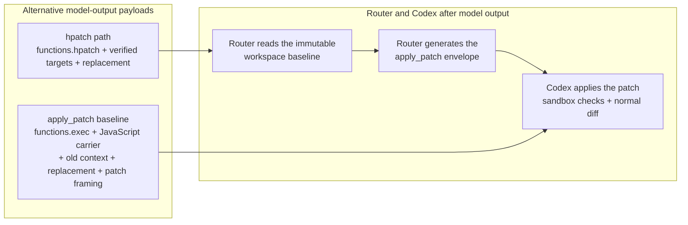

# hpatch

A Codex Responses router that gives agents verified atomic edits and direct script execution without Code Mode wrapper ceremony.

`hpatch-router` sits between Codex and the Responses API. It replaces the model-facing Code Mode `apply_patch` and `exec_command` surfaces with constrained `functions.hpatch` and free-form `functions.shell`. Successful calls still return native Codex carriers, so sandbox checks, permissions, command sessions, and the normal diff UI remain intact. The repository also exposes the reusable Go edit engine used by the router.

TL;DR:

| Goal | Start here |
| --- | --- |
| Route Codex edits through hpatch | [Install and configure the Codex router](#codex-router-systemd-user-service) |
| Understand verified editing | [Why hpatch?](#why-hpatch) |
| Run commands without Code Mode wrapper syntax | [Why shell?](#why-shell) |
| Remove contradictory stock editing guidance | [Codex model instructions](#codex-model-instructions) |
| Inspect measured token usage | [Metrics](#metrics), the dashboard, or `/api/metrics` |
| Use the engine without Codex | [Go library](#go-library) |
| Read the complete contract | [`doc/spec/interface.md`](doc/spec/interface.md) |

## Why hpatch?

A direct Code Mode edit makes the model repeat patch framing, old context, replacement text, and the JavaScript carrier. The router moves patch reconstruction out of model output:



The patch is not eliminated: the router generates it after inference. Savings are the difference between the two model-output payload estimates shown above. State reports, rejection diagnostics, and the net input cost of the hpatch and shell tool definitions plus persistent workflow guidance are tracked separately. Hread, hgrep, hsymbol, and inspect_file results are not compared with hypothetical shell commands; the dashboard's end-to-end Responses and session usage totals are authoritative for their model-input cost. Payload estimates remain reproducible GPT-5 estimates rather than provider billing totals.

For an 11-line function replacement, hpatch asks the model for this:

```text
functions.hpatch
in parser.go
type 42:e217..52:d10b <<PATCH
func parse(input []byte) (Document, error) {
	tokens, err := tokenize(input)
	if err != nil {
		return Document{}, fmt.Errorf("tokenize: %w", err)
	}
	document, err := buildDocument(tokens)
	if err != nil {
		return Document{}, fmt.Errorf("build document: %w", err)
	}
	return document, nil
}
PATCH
```

The same edit through direct `apply_patch` in Code Mode:

```text
functions.exec
const result = await tools.apply_patch(`*** Begin Patch
*** Update File: parser.go
@@
-func parse(input []byte) (Document, error) {
-	tokens := tokenize(input)
-	if len(tokens) == 0 {
-		return Document{}, errEmptyInput
-	}
-	document := buildDocument(tokens)
-	if document.Empty() {
-		return Document{}, errEmptyDocument
-	}
-	return document, nil
-}
+func parse(input []byte) (Document, error) {
+	tokens, err := tokenize(input)
+	if err != nil {
+		return Document{}, fmt.Errorf("tokenize: %w", err)
+	}
+	document, err := buildDocument(tokens)
+	if err != nil {
+		return Document{}, fmt.Errorf("build document: %w", err)
+	}
+	return document, nil
+}
*** End Patch
`);
text(result);
```

The direct call repeats all 11 old lines, then writes the same 11 new lines plus patch framing and the JavaScript carrier. Hpatch writes the new function once and identifies the old region with two verified rows.
The router also supplies `functions.hpatch` to the provider with a [Lark grammar](https://developers.openai.com/api/docs/guides/function-calling#context-free-grammars). As the model writes the tool call, only tokens that can still lead to a valid script are allowed. Bad syntax never becomes a finished tool call, so there is no generate-reject-retry cycle for it. Grammar is syntax only: a valid script can still fail for missing files, missing or stale rows, incomplete literal targets, or conflicting edits, and those failures stay atomic.

The smaller payload is only one benefit. Hpatch turns editing into a verified transaction:

| Direct-edit failure mode | Hpatch behavior |
| --- | --- |
| Repeated or stale context selects the wrong text | A `LINE:HASH` target verifies unchanged content and follows it only when its hash is unique. |
| Earlier edits shift the location of later edits | Every target is checked against one immutable invocation baseline. |
| One command in a multi-file change is invalid | The complete script is rejected and changes nothing. |
| Formatting or cleanup changes the final offsets | The report returns post-format final references, and the routed host preserves replacement-target mappings. |
| Generated code is syntactically invalid | Supported language validation rejects the transaction before Codex applies it. |

Hpatch does not bypass Codex to obtain these guarantees. The router evaluates the complete script without mutating the workspace, generates the ordinary `apply_patch` carrier, and lets Codex enforce the sandbox, permissions, and visible diff.

## Why shell?

Native `tools.exec_command` is Codex's execution backend. It is powerful, but calling it from Code Mode makes the model generate a JavaScript program, a JSON argument object, a quoted command, and an output projection:

```javascript
const result = await tools.exec_command({
  cmd: "python3 -c 'print(\"hello\")'"
});
text(result.output);
```

`functions.shell` is a model-facing adapter to that executor, not a replacement for it. The model sends the program body directly in its native syntax:

```python
#!python3
print("hello")
```

| Concern | Code Mode `tools.exec_command` call | `functions.shell` |
| --- | --- | --- |
| Model output | JavaScript wrapper, argument object, quoted command, and output projection | Exact script body |
| Quoting | Program text can cross JavaScript, JSON, and shell quoting layers | No outer heredoc or command-string wrapper |
| Interpreter | Encoded in the command construction | Selected by a compact shebang; Bash is the default |
| Standard input | Must be arranged through the wrapper and command | Remains available to the program |
| Correction | The model must emit the program again | Eligible programs can be retained, inspected, edited, and rerun |
| Execution policy | Codex native executor | The same Codex native executor, sandbox, permissions, and result |

This is better for the harness because it removes syntax that exists only to reach the executor. Fewer wrapper and quoting layers mean fewer malformed calls and simpler recovery; it is not a claim that the underlying process runs faster.

A one-line Bash program with no shebang or directive and containing one external command is sent directly to the native executor, so a call such as `rtk shadowtree test .` remains that command. Shell built-ins, private commands, composed scripts, command substitutions, explicit interpreter selection, directives, and other interpreters use the generated `shell <interpreter> <program>` carrier. Bash-safe escapes keep that generated carrier on one physical line while evaluation still reconstructs the exact program body.

`shell` can start PTY-backed, interactive, and long-running programs and forwards the native executor's complete result. If execution yields a session handle, use Codex's native session facilities to send further input, poll output, resize the PTY, or terminate the process; each shell call starts a new execution and does not reimplement session control.

For native executor background and interactive behavior, see [OpenAI's Codex prompting guide](https://developers.openai.com/cookbook/examples/gpt-5/codex_prompting_guide#shell_command).

## Requirements

- Go 1.26 or newer. Normal `go install` does not require a checkout.
- Hpatch router mode requires Codex CLI with ChatGPT file auth from `codex login`, normally at `~/.codex/auth.json` or `$CODEX_HOME/auth.json`. At startup, the router reads the adjacent `config.toml` only to determine whether `model_instructions_file` is configured.
- Hpatch router mode resolves Node.js 24 or newer as `node`; passthrough mode does not load the plugin registry.
- Private hgrep requires `rg` on the Codex executor's `PATH`.
- Private hsymbol requires the resolver for the queried language on the Codex executor's `PATH`:
  `gopls` for Go, TypeScript 7.0.2 or newer as `tsc` for JavaScript, TypeScript, and JSON,
  and `pyright-langserver` for Python `.py` and `.pyi` sources.
- Private hread, hgrep, hsymbol, and inspect_file are evaluated inside Bash or POSIX shell programs. The separately installed, fixed `shell` helper must be on the Codex executor's trusted `PATH`.
- The built-in shell uses the embedded `mvdan/sh`, including bash and sh shebangs; other selected interpreters must be available through the inherited `PATH` or a direct path.
- Source builds that regenerate the embedded plugin with `make install` or `go generate` require Bun. `make install` additionally requires Make.

## Install from a checkout

`make install` regenerates the embedded built-in plugin bundle and installs `hpatch-router` plus
the fixed `shell` helper through `go install`:

```sh
make install
```

Installation and uninstallation never create, edit, or remove Codex configuration or instruction
files. `make uninstall` removes only the installed `hpatch-router` and `shell` binaries.

### Configured plugins

The mandatory `builtin.shell` implementation comes from `plugins/shell.mjs` and is embedded during generation; `make install` does not copy it into user configuration.

Configured plugins are direct regular `.js` or `.mjs` files in `$XDG_CONFIG_HOME/hpatch/plugins` or `~/.config/hpatch/plugins` on Linux. The router loads them in lexical order into one immutable process snapshot. It does not discover workspace-local or remote plugins and does not hot-reload files. Restart `hpatch-router` after any plugin change. Invalid modules, duplicate identities, or an unusable built-in registry fail startup before the router listens. The full module contract is in [`doc/spec/interface.md`](doc/spec/interface.md).


## Shell tool

The model-visible `functions.shell` tool accepts one free-form program. A compact shebang selects its evaluator; a missing shebang selects Bash:

```python
#!python3
print("Hello")
```

`shell` can start PTY-backed, interactive, and long-running programs and forwards the native executor's complete result. If execution yields a session handle, use Codex's native session facilities to send further input, poll output, resize the PTY, or terminate the process; each shell call starts a new execution and does not reimplement session control.

### Retain, inspect, and rerun a program

Retention is temporary script state. A retained result includes `retained: true` and a `script_ref` such as `@shell/<call-id>`. The artifact is scoped to the Codex thread, expires after one hour by default, and is not a workspace file. Its thread directory is removed when the router shuts down.

Inspect retained source through the private shell command:

```sh
hread @shell/<call-id>
```

Copy an emitted `LINE:HASH` row into a complete hpatch script whose paths are all under `@shell/`. One script cannot mix retained and workspace paths. Rerun the current retained body with a shell call containing only:

```text
#!script=@shell/<call-id>
```

Retained edits use the router-owned artifact path rather than the normal workspace `apply_patch` carrier.

### Private shell commands

Hread, hgrep, hsymbol, and inspect_file are private commands recognized only by the Bash and POSIX shell evaluators.

```sh
hread parser.go 20:40
hgrep -e 'TranslateForHost' .
hsymbol refs internal/router/server.go 42:abcd Run 2
inspect_file internal/router/server.go | jq -c '.data.outline[]'
```

Inspect_file emits one exact JSON envelope with metadata, parser completeness, and a bounded structural outline; its private guidance includes a concise result shape rather than the specification schema. Its code formats are Go, Python `.py` and `.pyi`, and every stable TypeScript 7 source format: `.ts`, `.tsx`, `.d.ts`, `.mts`, `.d.mts`, `.cts`, `.d.cts`, `.js`, `.jsx`, `.mjs`, and `.cjs`. JSON remains a structural format. Markdown frontmatter is parsed as YAML, but only top-level scalar keys are returned. It never emits source bodies or scalar values. Hread emits `LINE:HASH TEXT`. Hgrep and hsymbol emit `"PATH":LINE:HASH TEXT`; hgrep searches text recursively and accepts GNU grep's `-R` as a no-op, while hsymbol runs one exact language-server query and emits canonical workspace-relative paths without a leading `./`. Use hread before editing because inspect_file lines are not HPATCH targets. See the [interface contract](doc/spec/interface.md) for complete inputs and failure behavior.

Hread, hgrep, and hsymbol share a 15,000 GPT-5-token soft output limit. One complete row may extend the
result through 15,500 tokens. If another row cannot be admitted, stdout retains only complete
verified rows, stderr reports that the result is incomplete, and the command exits nonzero.
Retry hread with a smaller range or narrow the hgrep search. An incomplete hsymbol result is not
a complete definition or reference set.

## Codex router (systemd user service)

In hpatch mode, the router validates authentication and turn metadata, constructs the complete
plugin registry, and installs standalone `functions.hpatch` and `functions.shell` tools. The
model also sees configured contributions marked model-visible. Hread, hgrep, hsymbol, and inspect_file
remain authenticated shell-internal commands; the router injects their workflow guidance and the durable
shell workflow into received Responses instructions.

For each eligible request, the router finds exactly one Code Mode custom `exec` owner: either directly inside the leading `additional_tools` item for app-server traffic or inside that item's `functions` namespace for CLI traffic. It removes the owner's native `apply_patch` and `exec_command` sections, preserves unrelated tools and namespaces, and appends only the request-specific execution parameter shape to the shell contract. Unsupported direct or top-level owner layouts fail before forwarding.

While a routed tool input is streaming, the router keeps its untranslated content private until
the complete input can be validated. Each withheld input delta produces a content-free native
`response.in_progress` event so Codex continues to observe downstream SSE activity. The validated
execution carrier is still emitted atomically when the complete input arrives.

When a request carries Responses `instructions`, the router replaces the pinned stock file-editing
section or refreshes an existing marked hpatch section. If neither section exists and
`model_instructions_file` is configured in `$CODEX_HOME/config.toml` (or `~/.codex/config.toml`),
the router preserves the customized instructions and appends the hpatch section. Without that
setting, a missing section is treated as an upstream model-instruction change and the request
fails before forwarding. Requests without `instructions`, including compaction requests, remain
unchanged. Codex resends instructions at session start, after compaction, at subagent start, and
after subagent compaction; inherited side conversations already carry the marked section and are
refreshed idempotently. Tool descriptions contain only call-local contracts and are not a fallback
prompt channel.

Under the default `--model-protocol native`, the router omits the leading `## CTP/2 transport`
section from the central guidance and the ordinary guidance and tool rewrite is the complete
model-visible transformation. Opt-in `--model-protocol ctp2` injects the complete source and
additionally applies the lossless Compact Token Protocol after the ordinary Hpatch rewrite.
Each eligible string independently chooses a token-positive exact dictionary for readable repeated
substrings. Tool outputs may instead use token-positive references to exact line ranges from earlier
visible tool outputs in the same request. CTP/2 keeps no hidden dictionary state: rebuilding visible
history reproduces the same representation, appending history cannot change earlier encoded bytes,
and compaction removes reference sources with the compacted history.
CTP decoding is inline representation work, not an additional inspection or tool workflow.
Strings without a profitable representation stay native, except that a native reserved CTP/2 prefix
uses the required literal escape. Validated compaction requests bypass CTP/2 entirely.
Responses roles, instruction priority, identifiers, reasoning, status, usage, schemas,
grammars, streaming, and compaction control remain native. Model-emitted tool names and call
payloads also remain native, so CTP does not compose with Hpatch, shell, or function execution.
The superseded `--model-protocol ctp1` selector is rejected.

Defaults:

| Setting | Default |
| --- | --- |
| Mode | `hpatch` (`--mode`); `passthrough` forwards Responses traffic without loading the tool registry |
| Model protocol | `native` (`--model-protocol`); `ctp2` is opt-in and Hpatch-only, while `ctp1` and `ctp2` with `--mode passthrough` are rejected |
| Mentor Handoff | Disabled (`--mentor-handoff`); the experiment is Hpatch-only |
| Provider base URL | `https://chatgpt.com/backend-api/codex` (`--provider-base-url`) |
| Listen | `127.0.0.1:8080` (`--listen`) |
| Upstream response-start timeout | `10m` (`--timeout`) |
| Upstream stream idle timeout | `4m` per blocked upstream read (`--stream-idle-timeout`); resets on byte progress, pauses during downstream processing, and imposes no total-duration limit |
| Auth | `~/.codex/auth.json`, or `$CODEX_HOME/auth.json`; Codex owns login and refresh |
| Shell runtime directory | `$HPATCH_RUNTIME_DIR`, or the operating-system temporary directory when unset; router and executor must resolve the same absolute path |
| Metrics / hooks | `$XDG_CONFIG_HOME/hpatch` or `~/.config/hpatch` |
| Endpoints | `POST /v1/responses`, `GET /v1/models`, `GET /` (dashboard), `GET /api/metrics` |

### Mentor Handoff experiment

`--mentor-handoff` enables the first incremental form of **Mentor Handoff** for spawned subagents.
It activates only when Codex supplies both the exact `x-openai-subagent: collab_spawn` header and
`subagent_kind: thread_spawn` turn metadata. Ordinary sessions and forks do not activate it, and
new-session, post-compaction, and side-conversation activation are not implemented yet.

For a spawned subagent requesting `gpt-5.6-luna` or `gpt-5.6-terra`, the router sends
`gpt-5.6-sol` with high reasoning while leaving the inherited input and every other request field
intact. After the mentor has produced three completed custom/function tool calls, it remains active
for one more completed response so it can consume the third call's result. The next request returns
to the Codex-configured model after that response, after two completed assistant messages, or after
the latest request reports at least 50,000 input tokens. That count already includes the inherited
conversation history. The token limit is checked after each response, so its final mentor request
may overshoot. Failed responses contribute reported input usage but do not
contribute tool calls or messages, and a failed result-consuming response does not complete handoff.

The router logs bounded progress without prompt content and attributes provider usage to the model
actually used. It retains completion state for up to 256 spawned subagent threads; another new
eligible subagent fails before provider forwarding rather than silently forgetting a completed
handoff. Passthrough mode rejects the flag.

`--provider-base-url` changes where the router sends Codex-managed credentials and Responses
traffic. Use it only with a trusted endpoint. The benchmark uses it to place a content-free capture
proxy between the router and the normal provider; ordinary deployments should keep the default.

Outcome hooks receive one event for each routed hpatch or recovery result. The event identifies
the emitted tool and exact model-emitted payload, the evaluated lifecycle stage, the outcome,
and emitted, evaluated, and translated-patch byte counts. Recovery Markdown labels the short
recovery payload as model-emitted, shows a compact resolved-operation delta, and states when
the router rebuilt a larger complete script. A routed evaluator failure invokes `hooks.outcome`
instead of also invoking `hooks.error`; a router-owned rejection that occurs before evaluation
reports `unevaluated/rejected`. Root commit failures report `applied/failed`.

In hpatch mode, run the router as the same login user as Codex so it can open the absolute workspace paths Codex sends and read the same credentials. A user systemd unit is the intended long-running setup.

Use `--mode passthrough` when the router should forward Responses traffic without installing hpatch or shell, loading private commands, enabling rejected-script recovery, or recording plugin metrics.

Use `--model-protocol ctp2` to enable the compact provider representation. See the
[CTP/2 contract](doc/spec/ctp.md) for its exact wire forms, token-positive selection, literal
fallback, restoration, and failure behavior.

### Install the binary

```sh
go install github.com/yusing/hpatch/cmd/hpatch-router@latest \
  github.com/yusing/hpatch/cmd/shell@latest
```

The binaries are installed under `$GOBIN`, or under `$(go env GOPATH)/bin` when `GOBIN` is unset. Ensure that directory is on the router and Codex executor `PATH`.

### Install and start the unit

Install the published user-unit template:

```sh
mkdir -p ~/.config/systemd/user
curl -fsSL https://raw.githubusercontent.com/yusing/hpatch/main/contrib/systemd/hpatch-router.service \
  -o ~/.config/systemd/user/hpatch-router.service
systemctl --user daemon-reload
systemctl --user enable --now hpatch-router.service
systemctl --user status hpatch-router.service
```

Optional: keep the service after logout:

```sh
loginctl enable-linger "$USER"
```

One-shot without the unit (still uses the installed binary):

```sh
hpatch-router --listen 127.0.0.1:8080
```

If auth lives outside `~/.codex`, or the binary is not in `~/go/bin`, use a drop-in:

```sh
systemctl --user edit hpatch-router.service
```

```ini
[Service]
Environment=CODEX_HOME=%h/.codex
ExecStart=
ExecStart=%h/.local/bin/hpatch-router --listen 127.0.0.1:9090
```

Then `systemctl --user daemon-reload && systemctl --user restart hpatch-router.service`.

### Point Codex at the router

Add a Responses provider in `~/.codex/config.toml` (or another Codex profile config under `~/.codex/`):

```toml
[model_providers.hpatch]
name = "hpatch"
base_url = "http://127.0.0.1:8080/v1"
wire_api = "responses"
requires_openai_auth = true
```

Make it the default for the whole config:

```toml
model_provider = "hpatch"
```

Or pick it per invocation (same pattern as other local providers):

```sh
codex --local-provider hpatch --oss
```

Profiles use the same provider block. Exact profile and `--local-provider` selection syntax is Codex-version-dependent; verify it against the installed Codex CLI.

Hpatch mode requires valid turn metadata, but its wire `workspaces` member is optional. Current Codex emits zero or one entry. No usable directory does not block the turn, never falls back to router cwd, and permits only absolute hpatch operands.

Useful checks:

```sh
systemctl --user status hpatch-router.service
journalctl --user -u hpatch-router.service -f
curl -sS http://127.0.0.1:8080/api/metrics
curl -sS http://127.0.0.1:8080/v1/models
# open http://127.0.0.1:8080/ for the local dashboard
```

The dashboard labels each collapsible session with the task title found for its UUID in `$CODEX_HOME/session_index.jsonl` (normally `~/.codex/session_index.jsonl`) and falls back to the UUID. The router resolves each session UUID once and shares that cached title with hpatch hook events.

### Codex model instructions

[`contrib/codex/file-editing-instructions.md`](contrib/codex/file-editing-instructions.md)
is the single source for CTP/2 representation rules and all durable HPATCH, shell, hread, hgrep,
hsymbol, and inspect_file
workflow guidance. The router applies it only to the in-memory `instructions` value of eligible
Responses requests. It never reads or writes the configured instruction file itself.

The marked section is refreshed idempotently. A recognized stock Codex file-editing section is
replaced together with its displaced rg and exec-command guidance. A customized prompt without
either recognized section receives the hpatch section only when the top-level
`model_instructions_file` setting exists in Codex's `config.toml`. Dynamic rejected-script
guidance continues to use the adjacent template. The router snapshots the setting at startup;
restart it after adding or removing the key.

## Go library

The module path is `github.com/yusing/hpatch`. The root package exposes workspace,
evaluation, translation, reporting, and host-metrics APIs as a Go library. Root-scoped workspace APIs use a caller-authorized `*os.Root` and root-relative cwd;
`Translate` and `TranslateForHost` emit root-relative patch paths. Router translation uses
`TranslateForHostAt`, retains cleaned host path identities for Codex to authorize, and never
uses router cwd as a fallback. See [`doc/spec/interface.md`](doc/spec/interface.md).

## Editing language (summary)

Authoritative guidance: [`contrib/codex/file-editing-instructions.md`](contrib/codex/file-editing-instructions.md). Contract: [`doc/spec/interface.md`](doc/spec/interface.md).

Hread and hpatch preview/context rows have the shape `LINE:HASH TEXT`. Copy the complete
`LINE:HASH` reference into a mutation target. The one-based line is a location hint. The
four-digit lowercase hash verifies exact content, including indentation, and follows an
unchanged row after intervening edits only when that hash identifies one row in the file.

Targets:

1. Complete logical line: `LINE:HASH`
2. Inclusive complete-line range: `LINE:HASH..LINE:HASH`
3. Exact literal occurrence(s) from a verified row through EOF: `LINE:HASH "TEXT" [COUNT]`
4. Exact literal occurrence(s) in the complete immutable baseline: `"TEXT" [COUNT]`

Rows first verify their named immutable-baseline line. When that location changed, hpatch
relocates an unchanged row only if its hash occurs once in the file; absent or duplicate
matches reject instead of choosing a target. After earlier commands shift a duplicate row, a
post-edit coordinate is also accepted only when it points to that exact pending row and maps
back to one unchanged baseline line. Introduced or modified content remains untargetable in the
same call. An anchored text target starts at its resolved row. Its quoted target may use
JSON-escaped `\n` (or equivalent `\u000A`) to match exact text across logical lines or through
a trailing LF; the quoted command itself must remain on one physical line. Raw newlines,
carriage returns, and other C0 controls except tab are invalid. If that anchor is stale but the
literal has exactly the requested number of matches in the complete baseline, the redundant
anchor is ignored; extra matches still reject. An unanchored text target starts at byte zero.
Every requested non-overlapping match must exist. Use the unanchored form when
exact current text is already known and a row would add no disambiguation.

Commands are `in` / `new` / `mv` / `rm`, target-bearing `type`, destination-bearing
`add`, and one targetless `type VALUE` immediately after `new`.

Rules worth remembering:

- Use `type` with a nonempty value to replace and `type` with an empty value to delete. Use `add LINE VALUE` or `add TEXT VALUE` to insert immediately before that destination, and `add EOF VALUE` to append. Ranges are not add destinations.
- Plan related reads before calling hread through shell. Hread accepts one path and optional range per command; batch known reads as separate hread commands in one shell script. Use explicit ranges after relevant locations are known, and remember that a bare path intentionally reads the complete file. A start past EOF fails; only an end past EOF returns available rows with a warning.
- Plan related searches before calling hgrep through shell: combine known patterns and paths in one command and use repeated `-e` for multiple patterns. Copy current `LINE:HASH` rows directly when sufficient.
- After an edit, do not read or search a changed file or a directory containing one merely to inspect, verify, or locate a follow-up target. Reuse the exact authored value, final-state row, or confirmed target mapping when available.
- First `in` of a file freezes its immutable invocation baseline. Pending edits never shift later targets.
- Submit every known related edit in one atomic script, including related multiline declarations and repeated `in PATH` sections. Split only when a later edit depends on validation or information unavailable before the current call. Keep unrelated large `<<PATCH` values in separate failure-domain calls.
- Prefer the smallest mutation that expresses the semantic change. When a formatter owns formatting, alignment, or indentation, do not replace surrounding lines merely to reproduce its output; let the formatter apply those changes. For example, add one struct field with one insertion rather than replacing the declaration.
- Preserve required indentation prefixes in indentation-sensitive languages such as Python.
- Before using a text-target count greater than one, count exact literal occurrences in the acquired immutable baseline. Never infer the count from the intended replacements; use hgrep or separate verified row anchors when it is not already visible.
- Use escaped `\n` in an anchored or unanchored quoted target when the exact known text spans
  logical lines or includes a trailing LF. Keep the target on one physical command line.
- After a successful invocation, reuse saved rows whose content is unchanged; hpatch follows a shifted row only when its hash is unique. For a routed whole-line or range replacement, the router resolves the exact pre-edit target after the executor confirms application. Use returned final-state `LINE:HASH` rows for other changed content. For exact content you just authored in a new file, use an unanchored literal target instead of inventing a row hash or rereading the file. Reports are bounded, so use focused hread or hgrep only when the exact target is absent or ambiguous; never reconstruct a row or range endpoint.
- Overlapping replacements or deletions and insertions strictly inside them fail atomically. Boundary insertions are valid.
- Use inline quoted values for short single-line edits; include `\n` when an insertion must form a new line. Reserve fixed `<<PATCH` for multiline or escape-heavy values.
- For regular expressions and other escape-heavy source, use fixed `<<PATCH` even for one line.
- A rejected routed script changes nothing. When every rejection is `row-stale`, its diagnostic lists only the rejected target-bearing commands with hashed `C...` handles. The router exposes `functions.hpatch_recover`, a separate custom-grammar tool whose sole form is `C... TARGET`, where `TARGET` is a different ordinary HPATCH/2 target. Submit one correction for each listed command in one payload. Recovery preserves operations, values, command order, and file context, rebuilds the complete script through the root text editor, and reevaluates it normally. An unchanged target, including an equivalent literal/count or single-row-range spelling, rejects before reevaluation and retains the same recovery baseline. Non-target and mixed failures require one complete corrected HPATCH/2 script. A re-rejection replaces the recovery baseline and invalidates every earlier handle. Recovery is separate from ordinary `functions.hpatch` and the root public APIs.

Additional boundaries:

- Parent directories for `new` and `mv` must already exist.
- `new` accepts at most one immediately following targetless initializer.
- Content introduced by one mutation is not targetable until a later invocation.
- Hgrep paths are JSON-quoted in output; copy the complete current row rather than reconstructing it.

### Automatic cleanup and validation

Hpatch validates the rendered final state before committing or producing a carrier:

- Changed Go files are formatted with `go/format`; validation reports every distinct actionable
  syntax-repair location from all changed Go files before rejecting the complete transaction.
  Parser cascades that resolve to the same command row are shown once.
- When Tree-sitter language support is available, changed `.py`, `.js`, and `.ts` files are
  syntax-checked with the same all-files aggregation. Diagnostics group locations once per
  responsible command and identify each generated line, column, and heredoc value row.
  Unchanged invalid files are not rejected.
- Supported linewise Python, JavaScript, and TypeScript indentation edits receive narrow baseline-aware correction. Ambiguous structure, comments, unsupported extensions, and mixed indentation units remain byte-exact or reject rather than being broadly rewritten.
- Git-default trailing whitespace, spaces before indentation tabs, and edit-attributed blank lines at EOF are cleaned only on changed lines. Untouched content and binary-looking files are preserved.
- Any syntax, indentation, target, or conflict failure remains atomic and leaves files unchanged.
- Valid scripts whose requested final state is already present succeed as `already-satisfied`,
  return no patch, and keep the rendered state report. Routed calls use a diagnostic-only carrier.
- Final-state and diagnostic previews escape leading spaces as `\x20` and leading tabs as `\t`, so indentation is visible without changing the hashed row reference.
- Independently detectable stale, missing, incomplete-literal, and reversed-range targets are
  collected before rejection. Stale repair context distinguishes current-line candidates,
  relocated matching hashes, absent hashes, and both range endpoints without choosing a target.
- Host results expose structured outcome, change, attempt, failure scope, suggestion, rejection,
  and patch-summary data. Language and edit-conflict failures state whether correction is
  field-local, multi-command, a new script, or a later transaction.

Exact language and correction behavior is part of the [interface contract](doc/spec/interface.md); this is not a general-purpose formatter for every file type.

Multiline example:

```text
in parser.go
type 42:e217..52:d10b <<PATCH
func parse(input []byte) (Document, error) {
	tokens, err := tokenize(input)
	if err != nil {
		return Document{}, fmt.Errorf("tokenize: %w", err)
	}
	document, err := buildDocument(tokens)
	if err != nil {
		return Document{}, fmt.Errorf("build document: %w", err)
	}
	return document, nil
}
PATCH
```

## Metrics

Metrics separate three different layers:

1. The host variants return `HostTranslation` with evaluator counters; basic `Apply` and `Translate` do not persist metrics.
2. A host supplies visible payload and session attribution to `RecordHostMetrics`, the only root persistence boundary. The router does this after routed outcomes and also records per-tool definitions, carriers, executor evidence, reports, diagnostics, and shell misuse or recovery overhead.
3. The router dashboard and `/api/metrics` expose provider Responses lifecycle and usage totals alongside those persisted estimates.

With CTP/2 enabled, the dashboard's CTP view and `/api/metrics` also expose auxiliary native and
compact token estimates for whole requests and assistant text from completed responses. They expose
active requests or missing instruction carriers, representation savings, encoded-string, local
dictionary, visible-line-reference, and codec totals, and bounded per-session CTP input and output
observations with native and compact tokens and bytes. Dropped observation counters make truncation
explicit. These internal compression counters are separate from authoritative provider usage and
never include model-emitted tool payloads. A request remains active even when no individual string
has a profitable compact form; those strings stay native.

The router dashboard and `GET /api/metrics` expose the structured persistent aggregate without opening an engine workspace.
Each terminal Responses log record also carries that logical request's provider token counts.

These are reproducible payload estimates, not provider billing totals. They omit reasoning tokens, commentary, and host-specific framing. Provider Responses usage is authoritative for end-to-end input and output totals. Metrics are auxiliary and never replace a successful edit, command result, or rejection diagnostic. Passthrough mode does not install hpatch or plugin metric accounting.

Hand-authored scenario comparison (does not update persistent router metrics):

```sh
go run ./compare
```

### Historical CTP replay diagnostic

To inspect CTP/2 input representation savings on a previous long Codex session without
calling a model provider, run the package-local benchmark once:

```sh
go test ./internal/router -run '^$' -bench '^BenchmarkCTPLongSessionReplay$' -benchtime=1x
```

The benchmark reads `$CODEX_HOME` (normally `~/.codex`) and excludes `CODEX_THREAD_ID`. It requires
at least one string-valued Code Mode `exec` call and stock `apply_patch` plus `exec_command` base
instructions, rejects known Hpatch instruction fingerprints, and selects the matching completed
transcript with the highest recorded cumulative token usage. It applies recorded compactions and
replays one captured request snapshot per turn through the production CTP/2 codec. The result reports
native and compact input estimates, encoded strings, local dictionaries, visible-line references,
and whole-request and new-content savings. It does not modify the transcript or contact the provider.

For a broader one-shot comparison, replay the 50 longest matching sessions:

```sh
go test ./internal/router -run '^$' -bench '^BenchmarkCTPCorpusReplay$' -benchtime=1x -count=1
```

The corpus benchmark runs the production CTP/2 codec and reports ordinary whole-request savings and
`new_content_*` savings. The latter
counts the first request in full, then counts only changed non-input fields and input items after the
previous exact item prefix. A compaction therefore counts its replacement history again. This
separates repeated unchanged history from newly introduced representation cost without assuming a
provider cache granularity, hit rate, or billing discount. Median and `*_gate_sessions` metrics show
how many individual sessions meet the benchmark's 5% comparison threshold.

Codex transcripts retain base instructions, dynamic tools, response items, and compaction history,
but not the exact original Code Mode tool envelope or provider-emitted compact assistant text. This
diagnostic therefore cannot establish provider usage, prompt-cache behavior, or assistant-output
savings. Hpatch restores routed calls to the same Code Mode carrier, so transcripts do not retain a
definitive router-mode field. The stock-instruction requirement and known-Hpatch rejection are a
conservative historical fingerprint, not proof against custom instructions or unknown older router
versions.

### End-to-end benchmark

The executable benchmark requires Docker, Codex authentication, and a local etcd checkout. It retains run artifacts for inspection; read the [benchmark methodology](doc/benchmarks.md) before running:

```sh
bash benchmarks/bench.sh
```

For an evidence-collection treatment run, set
`BENCHMARK_RETAIN_EXACT_HPATCH_EVIDENCE=true` with `BENCHMARK_MODE=hpatch-only` or
`hpatch-diagnostic`. This default-disabled option retains only exact hpatch/recovery payloads and
their final model-visible reports or diagnostics in the private run artifact; it does not capture
shell traffic, credentials, rebuilt scripts, or patches.

The paired benchmark runs one stock Codex control attempt and one Hpatch attempt
from independent copies of the same historical etcd base revision, alternating
which arm runs first. Hidden executable tests and an allowed-path boundary grade
correctness before timing or token-efficiency differences are considered. The
active task, `etcd-range-stream`, reconstructs etcd's cross-layer server-side
RangeStream behavior. See the [benchmark methodology](doc/benchmarks.md), the
[fixed control baseline](benchmarks/results/c07600a74ac93d1ac6c38c47b80d85519458bc9f-1/summary.md),
and locally retained Hpatch-only trial reports.

To measure deployable model behavior, CTP efficiency, and their net operational result, run
the fresh native-versus-CTP/2-active benchmark:

```sh
TASK_ID=batch-diagnostic-collapse BENCHMARK_MODE=ctp-only \
  BENCHMARK_REPORT_ISSUES=false REPETITIONS=4 bash benchmarks/bench.sh
```

Each repetition runs native Hpatch without CTP guidance and CTP/2-active Hpatch with the guidance and
CTP/2 enabled. Their order rotates across repetitions, and each starts from an independent task
snapshot. The report separates
model correctness, turns, tool behavior, and latency; same-request CTP token, byte, dictionary, and
codec measurements; and provider-observed input, output, reasoning, requests, and wall time. It also
retains per-request usage and classifies executor, router, Hpatch, and CTP failures without removing
them from the operational outcome. The task grades the same exact decoded final response in both
arms and requires strictly smaller compact input and assistant-output representations. Four
repetitions schedule eight paid model attempts.

Benchmark Codex processes disable `apps` identically in both arms.

To compare an original-model subagent with Mentor Handoff, run two paired repetitions:

```sh
MODEL=gpt-5.6-luna REASONING_EFFORT=xhigh REPETITIONS=2 \
  BENCHMARK_MODE=mentor-handoff BENCHMARK_REPORT_ISSUES=false \
  bash benchmarks/bench.sh
```

Both arms receive the same Hpatch tools, independent workspace snapshots, static parent prompt,
and static child role and prompt. In both arms a `gpt-5.6-sol` high parent spawns exactly one child
whose locked configured model and reasoning are selected by `MODEL` and `REASONING_EFFORT`. The
`hpatch` child uses that configured model throughout. The `hpatch-mentor` child temporarily uses
`gpt-5.6-sol` high and must demonstrate a later request from the same child using its configured
model. Reports separate parent, mentor, and actual-child input, cached-input, output, and reasoning
tokens, while the A/B comparison uses their combined provider-facing capture totals.

For this experiment, each arm runs through a transparent two-sided capturer:
Codex → capturer → Hpatch router → capturer → provider. The provider-facing side records the actual
model and usage, while the Codex-facing side records restored tool-call identities. The front adds a
private per-request correlation header that the back removes before provider forwarding. The report joins
the two records by that identity, attributes every measured same-path loop
to exactly one actual provider model, and fails rather than guessing when the join is missing or
ambiguous. Captures omit credentials, prompts, tool arguments, command output, and response text.

The benchmark also retains a normalized `child-events.jsonl` per attempt from a host-owned, isolated
Codex home. It includes completed child command and file-change items but excludes command output and
raw rollout content, allowing command-loop comparisons across both arms. A content-free
`child-proof.json` verifies the direct-child lineage, locked model and effort, and identical effective
developer prompt across arms even though Codex 0.150.1 omits the completed spawn from root `--json`
output. It retains only the child thread correlation needed to join the capturer. Missing or ambiguous child telemetry, including an unobserved nested spawn, fails the attempt
instead of being reported as zero.

The one-repetition `gpt-5.6-sol` Hpatch baseline passed and reported 45.2% lower
successful edit payload (2,096 tokens versus 3,825 control-equivalent tokens). It used
25 model requests, one once-recovered rejection chain, and no changed-file read → edit →
read loop. It is one observed run, not a general performance guarantee.

## How it works

Root library path: accept a caller-authorized workspace root and cwd → parse the complete script → verify immutable baselines → render and validate disjoint changes → return a completed result for atomic commit or one non-mutating translated patch.

Router hpatch path: validate auth and metadata → load the immutable tool registry → inject the
central guidance into received Responses instructions → replace the eligible Code Mode tool
surfaces → optionally encode the token-positive model-visible data plane with CTP/2 → select an
optional canonical directory hint → decode the provider response → evaluate hpatch without router
filesystem confinement or router-cwd fallback → return a client-executed `apply_patch` carrier.

Router shell path: translate the free-form tool call into one native executor call → invoke the authenticated router worker in Codex's working directory, environment, sandbox, and permissions → evaluate Bash or POSIX shell with `mvdan/sh`, dispatch private commands directly, or run another selected interpreter → forward the complete native result. Passthrough mode skips registry construction and request rewriting.

## Project structure

```text
.
├── cmd/
│   └── hpatch-router/            # Router process entry point
├── internal/
│   ├── hpatchsyntax/             # Shared quoted-string and heredoc framing
│   ├── patchtest/                # Translated-patch test helper
│   └── router/
│       └── toolplugin/            # Plugin host, generation, snapshots, and tests
├── plugins/                       # Built-in shell, hread, hgrep, hsymbol, and inspect_file sources
├── benchmarks/                   # Runner, tasks, containers, and checked-in results
├── compare/                      # Hand-authored payload scenarios
├── contrib/
│   ├── codex/                    # Central model guidance and recovery template
│   └── systemd/                  # User service unit
├── doc/                          # Specifications, architecture, and benchmark manuals
├── *.go                          # Reusable edit engine, validation, transactions, and metrics
├── Makefile                      # Plugin generation and binary installation
└── tool_grammar.lark             # Embedded constrained-decoding grammar
```

Tests live beside the owners they exercise. The root `hpatch` package is the reusable engine; `internal/router` calls it rather than maintaining a separate editing implementation. The router embeds its dashboard and generated built-in plugin bundle.

## Documentation

| Doc | Contents |
| --- | --- |
| [`doc/brief.md`](doc/brief.md) | Product brief and scope |
| [`doc/spec/index.md`](doc/spec/index.md) | Specification inventory |
| [`doc/spec/interface.md`](doc/spec/interface.md) | Engine, router, plugin, shell, rejected-script recovery, and metrics contracts |
| [`doc/spec/comparison.md`](doc/spec/comparison.md) | Payload comparison scenarios |
| [`doc/spec/benchmark.md`](doc/spec/benchmark.md) | Benchmark requirements |
| [`doc/architecture/index.md`](doc/architecture/index.md) | Stable ownership boundaries |
| [`doc/benchmarks.md`](doc/benchmarks.md) | Benchmark operation and interpretation |
| [`doc/codex-router-e2e.md`](doc/codex-router-e2e.md) | Codex-facing end-to-end procedure |
| [`contrib/systemd/hpatch-router.service`](contrib/systemd/hpatch-router.service) | User service template |
| [`contrib/codex/file-editing-instructions.md`](contrib/codex/file-editing-instructions.md) | Persistent CTP/2, edit, shell, read, search, and inspection guidance for Codex |
| [`AGENTS.md`](AGENTS.md) | Architecture and repository navigation for agents |

Library use: module path `github.com/yusing/hpatch`. Importable as a library (`hpatch.Translate`, `hpatch.Workspace`, structured host metrics helpers); hosts should open an `*os.Root` capability for the workspace before calling in.

## Development

### Agent issue reports

Starting the router in hpatch mode with `HPATCH_DIAGNOSE=1` adds the model-visible,
free-form `report_issue` tool. The tool is intended for agent-experience problems in hpatch
and its related tools, such as misleading instructions or unhelpful diagnostic and repair
context. It is absent when the variable has any other value and in passthrough mode.

A report runs every `hooks.diagnose` command in
`$XDG_CONFIG_HOME/hpatch/settings.json` or `~/.config/hpatch/settings.json` on Linux:

```json
{
  "hooks": {
    "diagnose": [
      "your-command {{shellquote (format_markdown .)}}"
    ]
  }
}
```

`format_markdown` and `.Body` both contain the agent's exact Markdown. Diagnose hooks share
a 10-second timeout. A missing hook list is a successful no-op; rendering, execution, and timeout
failures make the tool call fail. The router reads the list before each `report_issue` invocation,
so changes to `hooks.diagnose` take effect without a restart. `report_issue` is handled directly
by the router; it does not install an executable wrapper, frontend, or tool binary.

```sh
go generate ./internal/router/toolplugin
bun test ./internal/router/toolplugin/tests
go test ./...
go vet ./...
make install
```

Focused checks are `go test .` for the engine, `go test ./internal/router` for routing and plugins, and `go test ./cmd/hpatch-router ./cmd/shell` for the process entry points.
