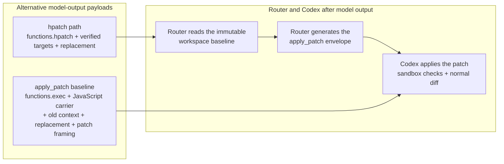

# hpatch

A Codex Responses router that gives agents verified atomic edits and direct
script execution, without Code Mode wrapper ceremony.

`hpatch-router` sits between Codex and the Responses API. The model sees
constrained `functions.hpatch` and free-form `functions.shell`. Successful
calls still return native Codex carriers, so sandbox checks, permissions,
command sessions, and the normal diff UI stay intact. The repository also
exposes the reusable Go edit engine used by the router.

| Goal | Start here |
| --- | --- |
| Install and route Codex through hpatch | [Codex router](#codex-router) |
| See what you get | [Features](#features) |
| Understand verified editing | [Why hpatch?](#why-hpatch) |
| Run programs without Code Mode wrappers | [Why shell?](#why-shell) |
| Inspect live usage | [Metrics](#metrics) |
| Use the engine without Codex | [Go library](#go-library) |
| Read contracts | [`doc/spec/index.md`](doc/spec/index.md) |

## Features

### User experience

- Codex still owns sandboxing, permissions, process sessions, and the visible
  patch diff. The router translates; it does not silently commit workspace
  edits.
- A human-readable dashboard lives at the router root, for example
  `http://127.0.0.1:8080/`. The same listener serves Responses, models, and
  `/api/metrics`.
- A systemd user unit is the intended long-running setup. Passthrough mode
  forwards Responses traffic without installing hpatch or plugins.
- Codex keeps seeing stream activity while a tool call is validated; the
  router withholds untranslated input until the complete payload is ready.
- Optional `--capture-output` appends sanitized JSONL for later inspection.
  Outcome hooks can record each routed hpatch or recovery result.

### Agent experience

- `functions.hpatch` is a verified atomic edit language: copy a `LINE:HASH`
  row, emit the new text once, and let the router build the patch.
- `functions.shell` sends the program body in its native syntax. Compact
  shebangs select the interpreter; Bash is the default.
- Private shell commands stay inside Bash and POSIX programs: `hread` for
  verified rows, `hgrep` for text search, `hsymbol` for language-server
  lookup, and `inspect_file` for a structural outline whose spans are copyable
  `LINE:HASH` identities without source bodies.
- Eligible programs can be retained, inspected, edited, and rerun through
  `@shell/` references. Wholly stale-target rejections use
  `functions.hpatch_recover` instead of rewriting the whole script.
- A [Lark grammar](https://developers.openai.com/api/docs/guides/function-calling#context-free-grammars)
  constrains HPATCH syntax as the model writes it. Supported languages are
  validated before Codex applies the patch. Configured plugins can join the
  model-visible catalog.
- `HPATCH_DIAGNOSE=1` adds a free-form `report_issue` tool for
  agent-experience problems. See [`REQ-DIAGNOSE-001`](doc/spec/diagnose.md).
- Subagent activity shows the requested role, model, reasoning effort, and
  exact replies as commentary without exposing encrypted collaboration
  messages. Root and subagent stops also report input, cached-input, output,
  and reasoning token usage. Router commentary is visible in Codex but is
  removed before later model requests.

### Token saving

- The hpatch family avoids repeating old context. `hpatch` identifies a
  verified region and writes the replacement once. `hread`, `hgrep`,
  `hsymbol`, and `inspect_file` emit copyable `LINE:HASH` identities.
  `inspect_file` still returns structure instead of file bodies.
- `functions.shell` drops the JavaScript carrier, JSON argument object, and
  extra quoting layers that Code Mode `exec_command` requires.
- [CTP/2](doc/spec/ctp.md) is the default lossless encoding of eligible
  model-visible request strings and assistant text between the Hpatch-projected
  request and the provider. Repeats inside one string can become a local
  dictionary; tool outputs may instead point at earlier visible output lines
  in the same request. Newly emitted tool names and payloads stay native.
  Validated compaction requests stay native and skip CTP/2. Use
  `--model-protocol native` to disable it.
- A Lark grammar constrains HPATCH generation so the model does not have to
  retry invalid syntax. A completed invalid script is still rejected
  atomically.

### Performance

- Mentor Handoff sends eligible spawned `gpt-5.6-luna` and `gpt-5.6-terra`
  children as `gpt-5.6-sol` with high reasoning, then returns to the
  Codex-configured model. Only an AgentControl `collab_spawn` with
  `subagent_kind: thread_spawn` activates it; ordinary sessions and forks stay
  unchanged. Disable with `--mentor-handoff=false`. See
  [`REQ-MENTOR-001`](doc/spec/mentor.md).

## Why hpatch?

A direct Code Mode edit makes the model repeat patch framing, old context,
replacement text, and a JavaScript carrier. The router moves patch
reconstruction out of model output:



The patch is not eliminated: the router generates it after inference.

For an 11-line function replacement, hpatch asks the model for this:

```text
functions.hpatch
in parser.go
type 42:e217..52:d10b <<PATCH
func parse(input []byte) (Document, error) {
	tokens, err := tokenize(input)
	if err != nil {
		return Document{}, fmt.Errorf("tokenize: %w", err)
	}
	document, err := buildDocument(tokens)
	if err != nil {
		return Document{}, fmt.Errorf("build document: %w", err)
	}
	return document, nil
}
PATCH
```

Direct `apply_patch` in Code Mode repeats all 11 old lines, then writes the
same 11 new lines plus patch framing and the JavaScript carrier. Hpatch writes
the new function once and identifies the old region with two verified rows.

That smaller payload is only one benefit. Editing becomes a verified
transaction: targets check an immutable invocation baseline, a bad command
rejects the whole script, and supported language validation runs before Codex
applies anything. Grammar is syntax only; missing files, stale rows, and
conflicting edits still fail atomically.

See [`REQ-SCRIPT-001`](doc/spec/script.md), [`REQ-SELECT-001`](doc/spec/select.md),
and [`REQ-OUTPUT-001`](doc/spec/output.md). Authoritative agent workflow:
[`contrib/codex/file-editing-instructions.md`](contrib/codex/file-editing-instructions.md).

## Why shell?

Native `tools.exec_command` is Codex's execution backend. Calling it from Code
Mode makes the model generate a JavaScript program, a JSON argument object, a
quoted command, and an output projection. `functions.shell` is an adapter to
that same executor: the model sends the program body directly.

```python
#!python3
print("hello")
```

| Concern | Code Mode `tools.exec_command` | `functions.shell` |
| --- | --- | --- |
| Model output | JavaScript wrapper, argument object, quoted command, and output projection | Exact script body |
| Quoting | Program text can cross JavaScript, JSON, and shell quoting layers | No outer heredoc or command-string wrapper |
| Interpreter | Encoded in the command construction | Compact shebang; Bash is the default |
| Standard input | Arranged through the wrapper | Remains available to the program |
| Correction | The model must emit the program again | Eligible programs can be retained, inspected, edited, and rerun |
| Execution policy | Codex native executor | The same Codex native executor, sandbox, permissions, and result |

This is better for the harness because it removes syntax that exists only to
reach the executor. It is not a claim that the underlying process runs faster.

A one-line Bash program with no shebang or directive and containing one
external command is sent directly to the native executor, so a call such as
`rtk shadowtree test .` remains that command. Composed scripts, private
commands, and other interpreters use the generated
`shell <interpreter> <program>` carrier.

`shell` can start PTY-backed, interactive, and long-running programs and
forwards the native executor's complete result. If execution yields a session
handle, use Codex's native session facilities; each shell call starts a new
execution. See [OpenAI's Codex prompting guide](https://developers.openai.com/cookbook/examples/gpt-5/codex_prompting_guide#shell_command)
and [`REQ-SHELL-001`](doc/spec/shell.md).

## Inline operation commentary

In router mode, extensible non-strict function tools receive an optional `commentary` string.
The router shows explicit text, or a concise default when it is omitted, immediately before the
tool call. It removes only the router-owned field before execution and restores the provider's
exact call when replaying history. Strict tools, provider-configured `additional_tools`, and tools
that already own a `commentary` parameter keep their schemas and arguments unchanged and receive
defaults only. Collaboration tools remain under the subagent commentary contract described by
[`REQ-COMMENTARY-001`](doc/spec/commentary.md) and do not receive generic operation commentary.
The injected model guidance permits agent-authored progress only through supported tool calls;
standalone assistant commentary messages are router-owned.

Code Mode can publish evaluated progress while it runs:

```js
for (let index = 1; index <= total; index++) {
  await commentary(`Running item ${index}/${total}`);
  await tools.exec_command({cmd: commands[index - 1]});
}
```

Bash and POSIX shell programs use the reserved `commentary` command:

```sh
for item in "$@"; do
  commentary "Running $item"
  process "$item"
done
```

Both forms publish through an authenticated per-call route on the router's existing HTTP server.
They write nothing to the tool result. Shell commentary expands its arguments and otherwise leaves
normal shell control flow, redirections, output, and exit status alone. A shell call without an
authored `commentary` command emits no default.

Events ready when a streaming response completes are shown in that response. Later events, and
events from JSON responses, are shown at the start of the next response for the same session.
Routes, queued events, request bodies, and retention time are bounded; commentary is auxiliary, so
capacity or publication failure never changes the operation result.

## Requirements

- Go 1.26 or newer with CGO and a C toolchain. Normal `go install` does not require a checkout.
- Hpatch router mode requires Codex CLI with ChatGPT auth from `codex login`
  so each request carries a Bearer token and ChatGPT account header. Codex
  normally stores that file auth at `~/.codex/auth.json` or
  `$CODEX_HOME/auth.json`. At startup, the router reads the adjacent
  `config.toml` only to determine whether `model_instructions_file` is
  configured.
- Hpatch router mode resolves Node.js 24 or newer as `node`; passthrough mode
  does not load the plugin registry.
- Private hgrep requires `rg` on the Codex executor's `PATH`.
- Private hsymbol requires the resolver for the queried language on the Codex
  executor's `PATH`: `gopls` for Go, TypeScript 7 as `tsc` for JavaScript,
  TypeScript, and JSON, and `pyright-langserver` for Python `.py` and `.pyi`
  sources.
- Private hread, hgrep, hsymbol, and inspect_file are evaluated inside Bash or
  POSIX shell programs. The separately installed, fixed `shell` helper must be
  on the Codex executor's trusted `PATH`.
- The built-in shell uses the embedded `mvdan/sh`, including bash and sh
  shebangs; other selected interpreters must be available through the
  inherited `PATH` or a direct path.
- Source builds that regenerate embedded plugin assets with `make install` or
  `go generate` require Bun. `make install` additionally requires Make.

## Install from a checkout

`make install` regenerates the embedded built-in plugin bundle and installs
`hpatch-router` plus the fixed `shell` helper through `go install`:

```sh
make install
```

Installation and uninstallation never create, edit, or remove Codex
configuration or instruction files. `make uninstall` removes only the
installed `hpatch-router` and `shell` binaries.

### Configured plugins

The mandatory `builtin.shell` implementation comes from `plugins/shell.mjs`
and is embedded during generation; `make install` does not copy it into user
configuration.

Configured plugins are direct regular `.js` or `.mjs` files in
`$XDG_CONFIG_HOME/hpatch/plugins` or `~/.config/hpatch/plugins` on Linux. The
router loads them in lexical order into one immutable process snapshot. It
does not discover workspace-local or remote plugins and does not hot-reload
files. Restart `hpatch-router` after any plugin change. Invalid modules,
duplicate identities, or an unusable built-in registry fail startup before the
router listens. The module contract is [`REQ-PLUGIN-001`](doc/spec/plugin.md).

Plugins can import the router-owned portable core directly:

```js
import {
  hashLine,
  lineBounds,
  parseRowReference,
} from "hpatch:core/v1";
```

The versioned module provides verified-row hashing and logical-line bounds,
compact quoted and row parsing, source-format capabilities, Go lexical helpers,
and shell-header parsing. It deliberately provides no filesystem, symlink,
workspace, process, or carrier authority. A plugin that imports an unavailable
core version fails validation before the router listens. The TypeScript surface
is declared in
[`internal/router/toolplugin/core-v1.d.ts`](internal/router/toolplugin/core-v1.d.ts).

## Shell tool

Everyday `functions.shell` use is a free-form program. Compact shebang,
interpreter selection, and session behavior are in [Why shell?](#why-shell)
and [`REQ-SHELL-001`](doc/spec/shell.md).

### Retain, inspect, and rerun

A retained result includes `retained: true` and a `script_ref` such as
`@shell/<call-id>`. The artifact is scoped to the Codex thread, expires after
one hour by default, and is not a workspace file. Its thread directory is
removed when the router shuts down.

```sh
hread @shell/<call-id>
```

Copy an emitted `LINE:HASH` row into a complete hpatch script whose paths are
all under `@shell/`. Do not mix retained and workspace paths in one script.
Rerun the current retained body with:

```text
#!script=@shell/<call-id>
```

Retained edits use router-owned storage rather than the workspace
`apply_patch` carrier. See [`REQ-SHELL-001`](doc/spec/shell.md).

### Private shell commands

Hread, hgrep, hsymbol, and inspect_file are recognized only by the Bash and
POSIX shell evaluators:

```sh
hread parser.go 20:40
hgrep -e 'TranslateForHostAt' .
hsymbol refs internal/router/server.go 42:abcd Run 2
inspect_file internal/router/server.go | jq -c '.data.outline[]'
```

Copy inspect_file `LINE:HASH` spans into HPATCH targets. Use hread when the
replacement needs unseen source text. Complete inputs and failure behavior:
[`REQ-READ-001`](doc/spec/read.md), [`REQ-GREP-001`](doc/spec/grep.md),
[`REQ-SYMBOL-001`](doc/spec/symbol.md), and
[`REQ-INSPECT-001`](doc/spec/inspect.md).

## Codex router

In hpatch mode, the router validates authentication and turn metadata,
constructs the plugin registry, and installs standalone `functions.hpatch` and
`functions.shell`. Configured contributions marked model-visible join that
catalog. Hread, hgrep, hsymbol, and inspect_file remain authenticated
shell-internal commands.

Defaults:

| Setting | Default |
| --- | --- |
| Mode | `hpatch` (`--mode`); `passthrough` forwards Responses traffic without loading the tool registry |
| Model protocol | `ctp2` (`--model-protocol`); `native` disables compaction; Hpatch-only |
| Mentor Handoff | Enabled (`--mentor-handoff`); Hpatch-only; disable with `--mentor-handoff=false` |
| Provider base URL | `https://chatgpt.com/backend-api/codex` (`--provider-base-url`) |
| Listen | `127.0.0.1:8080` (`--listen`) |
| Upstream response-start timeout | `10m` (`--timeout`) |
| Upstream stream idle timeout | `4m` of inactivity between bytes (`--stream-idle-timeout`) |
| Auth | Codex-managed ChatGPT credentials, typically `~/.codex/auth.json` or `$CODEX_HOME/auth.json`; Codex owns login and refresh |
| Shell runtime directory | `$HPATCH_RUNTIME_DIR`, or the operating-system temporary directory when unset; router and executor must resolve the same absolute path |
| Capture output | Disabled; `--capture-output PATH` appends sanitized JSONL |
| Hooks | `$XDG_CONFIG_HOME/hpatch` or `~/.config/hpatch` |
| Endpoints | `GET /` dashboard, `POST /v1/responses`, `GET /v1/models`, and `GET /api/metrics`, all on one listener |

`--provider-base-url` changes where the router sends Codex-managed credentials
and Responses traffic. Use it only with a trusted endpoint.

Use `--mode passthrough` to forward Responses traffic without installing
hpatch, shell, private commands, or rejected-script recovery. Capture remains
available because it observes the transport.

Hpatch mode defaults to CTP/2 and Mentor Handoff. Use `--model-protocol native`
to keep request and response strings uncompressed. See
[`REQ-CTP-001`](doc/spec/ctp.md). Use `--mentor-handoff=false` to leave spawned
subagents on their Codex-configured model. See
[`REQ-MENTOR-001`](doc/spec/mentor.md).

In hpatch mode, run the router as the same login user as Codex so it can open
the absolute workspace paths Codex sends. Codex attaches its managed
credentials to each request. A user systemd unit is the intended long-running
setup.

### Install the binary

```sh
go install github.com/yusing/hpatch/cmd/hpatch-router@latest \
  github.com/yusing/hpatch/cmd/shell@latest
```

The binaries are installed under `$GOBIN`, or under `$(go env GOPATH)/bin`
when `GOBIN` is unset. Ensure that directory is on the router and Codex
executor `PATH`.

### Install and start the unit

Install the published user-unit template:

```sh
mkdir -p ~/.config/systemd/user
curl -fsSL https://raw.githubusercontent.com/yusing/hpatch/main/contrib/systemd/hpatch-router.service \
  -o ~/.config/systemd/user/hpatch-router.service
systemctl --user daemon-reload
systemctl --user enable --now hpatch-router.service
systemctl --user status hpatch-router.service
```

Optional: keep the service after logout:

```sh
loginctl enable-linger "$USER"
```

One-shot without the unit (still uses the installed binary):

```sh
hpatch-router --listen 127.0.0.1:8080
```

If auth lives outside `~/.codex`, or the binary is not in `~/go/bin`, use a
drop-in:

```sh
systemctl --user edit hpatch-router.service
```

```ini
[Service]
Environment=CODEX_HOME=%h/.codex
ExecStart=
ExecStart=%h/.local/bin/hpatch-router --listen 127.0.0.1:9090
```

Then `systemctl --user daemon-reload && systemctl --user restart hpatch-router.service`.

### Point Codex at the router

Add a Responses provider in `~/.codex/config.toml`:

```toml
[model_providers.hpatch]
name = "hpatch"
base_url = "http://127.0.0.1:8080/v1"
wire_api = "responses"
requires_openai_auth = true
```

Make it the default for the whole config:

```toml
model_provider = "hpatch"
```

Or select it for one invocation with a profile. Put
`model_provider = "hpatch"` in `~/.codex/hpatch.config.toml` (the provider
block can live in the base config or in that file), then:

```sh
codex --profile hpatch
```

You can also overlay the same setting without a profile file:

```sh
codex -c 'model_provider="hpatch"'
```

Hpatch mode requires valid turn metadata, but its wire `workspaces` member is
optional. No usable directory does not block the turn, never falls back to
router cwd, and permits only absolute hpatch operands.

Useful checks:

```sh
systemctl --user status hpatch-router.service
journalctl --user -u hpatch-router.service -f
curl -sS http://127.0.0.1:8080/api/metrics
curl -sS http://127.0.0.1:8080/v1/models
```

### Codex model instructions

[`contrib/codex/file-editing-instructions.md`](contrib/codex/file-editing-instructions.md)
is the single source for CTP/2 representation rules and all durable HPATCH,
shell, hread, hgrep, hsymbol, and inspect_file workflow guidance. The router
applies it in memory and never reads or writes the configured instruction file.

The carrier is a nonempty top-level `instructions` string, or the first
textual developer message when that field is missing, null, or empty. A
recognized stock Codex file-editing section is replaced. A customized prompt
without that section receives the hpatch section only when
`model_instructions_file` is set in Codex's `config.toml`; without that
setting, a missing section fails before forwarding. Validated compaction
requests skip this rewrite. The router snapshots the setting at startup;
restart it after adding or removing the key. See
[`REQ-GUIDE-001`](doc/spec/guide.md).

## Go library

The module path is `github.com/yusing/hpatch`. The root package exposes
workspace evaluation, application, reporting, and host translation APIs.
Root-scoped application APIs use a caller-authorized `*os.Root` and
root-relative cwd. Host translation uses `TranslateForHostAt`, retains cleaned
host path identities for Codex to authorize, and never uses router cwd as a
fallback. See [`REQ-FILE-001`](doc/spec/file.md) and
[`CTR-TRANSLATE-001`](doc/architecture/translate.md).

## Metrics

Open the router root URL, such as `http://127.0.0.1:8080/`, for the dashboard.
`GET /api/metrics` returns the process-lifetime capturer snapshot. Provider
usage is authoritative for model consumption. Metrics are auxiliary and cannot
replace a successful edit, command result, or rejection diagnostic.

Use `--capture-output PATH` when durable evidence is needed. The file contains
sanitized JSONL: payload sizes, statuses, provider usage, tool identities, and
bounded outcome kinds. Raw prompts, scripts, patches, credentials, and full
diagnostics are discarded after measurement.

The executable benchmark requires Docker Compose, Codex authentication, and
the task's local source under `benchmarks/repos/`. The default task,
`etcd-range-stream`, needs a local etcd checkout. Read the
[benchmark methodology](doc/benchmarks.md) before running
`bash benchmarks/bench.sh`. Capture, snapshot shape, and comparison rules are
[`REQ-METRICS-001`](doc/spec/metrics.md) and
[`REQ-BENCH-001`](doc/spec/benchmark.md).

## Documentation

| Doc | Contents |
| --- | --- |
| [`doc/brief.md`](doc/brief.md) | Product brief and scope |
| [`doc/spec/index.md`](doc/spec/index.md) | Specification inventory; each listed file owns one requirement |
| [`doc/architecture/index.md`](doc/architecture/index.md) | Ownership-contract inventory |
| [`doc/benchmarks.md`](doc/benchmarks.md) | Benchmark operation and interpretation |
| [`doc/codex-router-e2e.md`](doc/codex-router-e2e.md) | Codex-facing end-to-end procedure |
| [`contrib/systemd/hpatch-router.service`](contrib/systemd/hpatch-router.service) | User service template |
| [`contrib/codex/file-editing-instructions.md`](contrib/codex/file-editing-instructions.md) | Persistent CTP/2, edit, shell, read, search, and inspection guidance |
| [`AGENTS.md`](AGENTS.md) | Agent workflow and repository navigation |

## Development

```sh
go generate ./internal/router/toolplugin
bun test ./internal/router/toolplugin/tests
go test ./...
go vet ./...
make install
```

Focused checks are `go test .` for the engine, `go test ./internal/router` for
routing and plugins, and `go test ./cmd/hpatch-router ./cmd/shell` for the
process entry points.

Starting the router in hpatch mode with `HPATCH_DIAGNOSE=1` adds the
model-visible `report_issue` tool. Configure `hooks.diagnose` in
`$XDG_CONFIG_HOME/hpatch/settings.json` or `~/.config/hpatch/settings.json`.
See [`REQ-DIAGNOSE-001`](doc/spec/diagnose.md).
