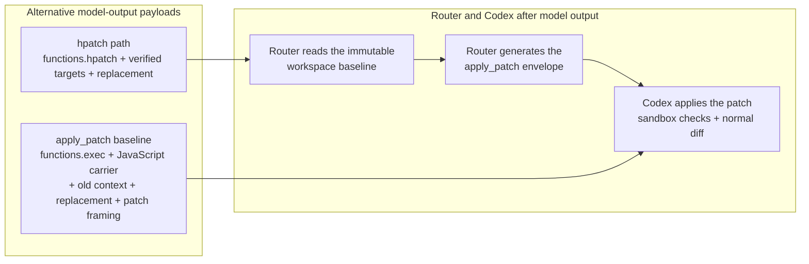

# hpatch

A Codex Responses router that gives agents verified atomic edits and direct script execution without Code Mode wrapper ceremony.

`hpatch-router` sits between Codex and the Responses API. It replaces the model-facing Code Mode `apply_patch` and `exec_command` surfaces with constrained `functions.hpatch` and free-form `functions.shell`. Successful calls still return native Codex carriers, so sandbox checks, permissions, command sessions, and the normal diff UI remain intact. The repository also includes the standalone `hpatch` CLI and reusable Go engine used by the router.

TL;DR:

| Goal | Start here |
| --- | --- |
| Route Codex edits through hpatch | [Install and configure the Codex router](#codex-router-systemd-user-service) |
| Understand verified editing | [Why hpatch?](#why-hpatch) |
| Run commands without Code Mode wrapper syntax | [Why shell?](#why-shell) |
| Remove contradictory stock editing guidance | [Codex model instructions](#codex-model-instructions) |
| Inspect measured token usage | [Metrics](#metrics), then run `hpatch gain` |
| Use the engine without Codex | [Standalone CLI](#standalone-cli) |
| Read the complete contract | `hpatch --help`, `hpatch --tool-help`, [`doc/spec/interface.md`](doc/spec/interface.md) |

## Why hpatch?

A direct Code Mode edit makes the model repeat patch framing, old context, replacement text, and the JavaScript carrier. The router moves patch reconstruction out of model output:



The patch is not eliminated: the router generates it after inference. Savings are the difference between the two model-output payload estimates shown above. State reports, rejection diagnostics, and the net input cost of the hpatch and shell tool definitions plus persistent workflow guidance are tracked separately. Hread, hgrep, and inspect_file results are not compared with hypothetical shell commands; the dashboard's end-to-end Responses and session usage totals are authoritative for their model-input cost. Gain values remain reproducible GPT-5 estimates rather than provider billing totals.

For an 11-line function replacement, hpatch asks the model for this:

```text
functions.hpatch
in parser.go
type 42:e217..52:d10b <<PATCH
func parse(input []byte) (Document, error) {
	tokens, err := tokenize(input)
	if err != nil {
		return Document{}, fmt.Errorf("tokenize: %w", err)
	}
	document, err := buildDocument(tokens)
	if err != nil {
		return Document{}, fmt.Errorf("build document: %w", err)
	}
	return document, nil
}
PATCH
```

The same edit through direct `apply_patch` in Code Mode:

```text
functions.exec
const result = await tools.apply_patch(`*** Begin Patch
*** Update File: parser.go
@@
-func parse(input []byte) (Document, error) {
-	tokens := tokenize(input)
-	if len(tokens) == 0 {
-		return Document{}, errEmptyInput
-	}
-	document := buildDocument(tokens)
-	if document.Empty() {
-		return Document{}, errEmptyDocument
-	}
-	return document, nil
-}
+func parse(input []byte) (Document, error) {
+	tokens, err := tokenize(input)
+	if err != nil {
+		return Document{}, fmt.Errorf("tokenize: %w", err)
+	}
+	document, err := buildDocument(tokens)
+	if err != nil {
+		return Document{}, fmt.Errorf("build document: %w", err)
+	}
+	return document, nil
+}
*** End Patch
`);
text(result);
```

The direct call repeats all 11 old lines, then writes the same 11 new lines plus patch framing and the JavaScript carrier. Hpatch writes the new function once and identifies the old region with two verified rows.
The router also supplies `functions.hpatch` to the provider with a [Lark grammar](https://developers.openai.com/api/docs/guides/function-calling#context-free-grammars). As the model writes the tool call, only tokens that can still lead to a valid script are allowed. Bad syntax never becomes a finished tool call, so there is no generate-reject-retry cycle for it. Grammar is syntax only: a valid script can still fail for missing files, missing or stale rows, incomplete literal targets, or conflicting edits, and those failures stay atomic.

The smaller payload is only one benefit. Hpatch turns editing into a verified transaction:

| Direct-edit failure mode | Hpatch behavior |
| --- | --- |
| Repeated or stale context selects the wrong text | A `LINE:HASH` target names one logical line and rejects changed content. |
| Earlier edits shift the location of later edits | Every target is checked against one immutable invocation baseline. |
| One command in a multi-file change is invalid | The complete script is rejected and changes nothing. |
| Formatting or cleanup changes the final offsets | The report returns post-format final references for the next invocation. |
| Generated code is syntactically invalid | Supported language validation rejects the transaction before Codex applies it. |

Hpatch does not bypass Codex to obtain these guarantees. The router evaluates the complete script without mutating the workspace, generates the ordinary `apply_patch` carrier, and lets Codex enforce the sandbox, permissions, and visible diff.

## Why shell?

Native `tools.exec_command` is Codex's execution backend. It is powerful, but calling it from Code Mode makes the model generate a JavaScript program, a JSON argument object, a quoted command, and an output projection:

```javascript
const result = await tools.exec_command({
  cmd: "python3 -c 'print(\"hello\")'"
});
text(result.output);
```

`functions.shell` is a model-facing adapter to that executor, not a replacement for it. The model sends the program body directly in its native syntax:

```python
#!python3
print("hello")
```

| Concern | Code Mode `tools.exec_command` call | `functions.shell` |
| --- | --- | --- |
| Model output | JavaScript wrapper, argument object, quoted command, and output projection | Exact script body |
| Quoting | Program text can cross JavaScript, JSON, and shell quoting layers | No outer heredoc or command-string wrapper |
| Interpreter | Encoded in the command construction | Selected by a compact shebang; Bash is the default |
| Standard input | Must be arranged through the wrapper and command | Remains available to the program |
| Correction | The model must emit the program again | Eligible programs can be retained, inspected, edited, and rerun |
| Execution policy | Codex native executor | The same Codex native executor, sandbox, permissions, and result |

This is better for the harness because it removes syntax that exists only to reach the executor. Fewer wrapper and quoting layers mean fewer malformed calls and simpler recovery; it is not a claim that the underlying process runs faster.

`shell` can start PTY-backed, interactive, and long-running programs and forwards the native executor's complete result. If execution yields a session handle, use Codex's native session facilities to send further input, poll output, resize the PTY, or terminate the process; each shell call starts a new execution and does not reimplement session control.

For native executor background and interactive behavior, see [OpenAI's Codex prompting guide](https://developers.openai.com/cookbook/examples/gpt-5/codex_prompting_guide#shell_command).

## Requirements

- Go 1.26 or newer. Normal `go install` does not require a checkout.
- Hpatch router mode requires Codex CLI with ChatGPT file auth from `codex login`, normally at `~/.codex/auth.json` or `$CODEX_HOME/auth.json`. Checkout installation also uses `codex debug models --bundled` when no `model_instructions_file` is configured.
- Hpatch router mode resolves Node.js 24 or newer as `node`; passthrough mode does not load the plugin registry.
- Private hgrep requires `rg` on the Codex executor's `PATH`.
- Private hread, hgrep, and inspect_file require the router executable directory to precede unrelated entries on the executor's trusted `PATH`.
- The built-in shell uses `bash` when no shebang is present; every selected interpreter must be available through the inherited `PATH`.
- Router and executor deployments with isolated filesystems must expose the frontend directory, authenticated snapshot, and router executable at the same absolute paths.
- Source builds that regenerate the embedded plugin with `make install` or `go generate` require Bun. `make install` additionally requires `make` and `jq`.

## Install from a checkout

`make install` regenerates the embedded built-in plugin bundle, installs `hpatch` and
`hpatch-router` through `go install`, and updates Codex's complete model-instructions file:

```sh
make install
```

If `model_instructions_file` is absent from `$CODEX_HOME/config.toml` or
`~/.codex/config.toml`, installation selects `CODEX_MODEL` or the bundled model with the
lowest priority value, writes `hpatch-model-instructions.md`, and adds the setting. If the
setting already exists, its value is unchanged and the referenced customized file is patched
in place. The installer also patches every `model_instructions_file` declared by personal
agent TOMLs under the adjacent `agents` directory; relative paths resolve from each agent
TOML. Config and agent TOML files remain unchanged. Stock Codex guidance, the earlier
unmarked hpatch guidance, and current marked guidance are supported. Content outside the
owned section is preserved; an unrecognized file fails instead of being overwritten.

### Configured plugins

The mandatory `builtin.shell` implementation comes from `plugins/shell.mjs` and is embedded during generation; `make install` does not copy it into user configuration.

Configured plugins are direct regular `.js` or `.mjs` files in `$XDG_CONFIG_HOME/hpatch/plugins` or `~/.config/hpatch/plugins` on Linux. The router loads them in lexical order into one immutable process snapshot. It does not discover workspace-local or remote plugins and does not hot-reload files. Restart `hpatch-router` after any plugin change. Invalid modules, duplicate identities, or an unusable built-in registry fail startup before the router listens. The full module contract is in [`doc/spec/interface.md`](doc/spec/interface.md).


## Shell tool

The model-visible `functions.shell` tool accepts one free-form program. A compact shebang selects an interpreter through the inherited `PATH`; a missing shebang selects Bash:

```python
#!python3
print("Hello")
```

The executor removes the shebang and supplies the exact remaining program through an anonymous script descriptor such as `/dev/fd/3`. It does not create an intermediate script file, and frontend standard input remains available as program data.

A leading `#!cmd=` assignment accepts one command template containing exactly one `{.}` frontend placeholder. A leading `#!params=` assignment accepts a JSON object of request-specific outer execution arguments, cannot contain `cmd`, and permits `login` only when it is `false`. The router normalizes safe leading near-misses through the same validation rather than treating them as program text.

`shell` can start PTY-backed, interactive, and long-running programs and forwards the native executor's complete result. If execution yields a session handle, use Codex's native session facilities to send further input, poll output, resize the PTY, or terminate the process; each shell call starts a new execution and does not reimplement session control.

### Retain, inspect, and rerun a program

Retention is temporary script state, not process-session state or workspace history. Non-Bash/sh programs and Bash/sh programs longer than three normalized lines are eligible. A retained result includes `retained: true` and a `script_ref` such as `@shell/<call-id>`. The artifact is scoped to the routing session, expires after one hour by default, is removed when the session closes, and is not a workspace file.

Inspect retained source through the private frontend:

```sh
hread @shell/<call-id>
```

Copy an emitted `LINE:HASH` row into a complete hpatch script whose paths are all under `@shell/`. One script cannot mix retained and workspace paths. Rerun the current retained body with a shell call containing only:

```text
#!script=@shell/<call-id>
```

Retained edits use the router-owned artifact path rather than the normal workspace `apply_patch` carrier.

### Private filesystem frontends

Hread, hgrep, and inspect_file are private shell frontends, not model-visible tools. Use inspect_file for bounded metadata and structure, hread for current target-bearing rows, and hgrep for current cross-file matches. Batch known reads as separate commands and combine known searches with repeated `-e` arguments:

```sh
hread parser.go 20:40
hgrep -e 'TranslateForHost' .
inspect_file internal/router/server.go | jq -c '.data.outline[]'
```

Inspect_file emits one exact JSON envelope with metadata, parser completeness, and a bounded structural outline; its private guidance includes a concise result shape rather than the specification schema. Markdown frontmatter is parsed as YAML, but only top-level scalar keys are returned. It never emits source bodies or scalar values. Hread emits `LINE:HASH TEXT`. Hgrep emits `"PATH":LINE:HASH TEXT`. Use hread before editing because inspect_file lines are not HPATCH targets. See the [interface contract](doc/spec/interface.md) for complete inputs and failure behavior.

## Codex router (systemd user service)

In hpatch mode, the router validates authentication and turn metadata, constructs the complete
plugin registry, and installs standalone `functions.hpatch` and `functions.shell` tools. The
model also sees configured contributions marked model-visible. Hread, hgrep, and inspect_file
remain authenticated shell frontends; Codex supplies their workflow guidance and the durable
shell workflow through the installed model-instructions file.

For each eligible request, the router finds exactly one Code Mode custom `exec` owner: either directly inside the leading `additional_tools` item for app-server traffic or inside that item's `functions` namespace for CLI traffic. It removes the owner's native `apply_patch` and `exec_command` sections, preserves unrelated tools and namespaces, and appends only the request-specific execution parameter shape to the shell contract. Unsupported direct or top-level owner layouts fail before forwarding.

The router leaves the request's existing Responses `instructions` value byte-equivalent.
Tool descriptions contain only call-local contracts; they are not a fallback prompt channel.

Hpatch translation uses the canonical directory hint from turn metadata when available. Metadata without a usable directory still forwards: absolute operands translate without a base, while relative operands reject rather than resolving from the router process cwd. Codex executes the returned `apply_patch` carrier and owns the sandbox, permissions, and visible diff. Shell, hread, hgrep, and inspect_file execute in Codex's actual working directory and environment; the router does not give their workers a router-owned filesystem capability. Background Responses requests are rejected before forwarding because the router does not expose the retrieval and cancellation endpoints needed to complete them.

The frontend directory, authenticated snapshot, and router executable must be visible at the same paths to the router and executor. Only one router process can own the stable basename frontends. A concurrent process fails before listening, while a restart can reclaim authenticated links left by a crash.

Defaults:

| Setting | Default |
| --- | --- |
| Mode | `hpatch` (`--mode`); `passthrough` forwards Responses traffic without loading the tool registry |
| Listen | `127.0.0.1:8080` (`--listen`) |
| Upstream response-start timeout | `10m` (`--timeout`) |
| Upstream stream idle timeout | `4m` per blocked upstream read (`--stream-idle-timeout`); resets on byte progress, pauses during downstream processing, and imposes no total-duration limit |
| Auth | `~/.codex/auth.json`, or `$CODEX_HOME/auth.json`; Codex owns login and refresh |
| Metrics / hooks | `$XDG_CONFIG_HOME/hpatch` or `~/.config/hpatch` |
| Endpoints | `POST /v1/responses`, `GET /v1/models`, `GET /` (dashboard), `GET /api/metrics` |

In hpatch mode, run the router as the same login user as Codex so it can open the absolute workspace paths Codex sends and read the same credentials. A user systemd unit is the intended long-running setup.

Use `--mode passthrough` when the router should forward Responses traffic without installing hpatch, shell, private frontends, rejected-script recovery, or plugin metrics.

### Install the binary

```sh
go install github.com/yusing/hpatch/cmd/hpatch-router@latest
```

The binary is installed under `$GOBIN`, or under `$(go env GOPATH)/bin` when `GOBIN` is unset. Ensure that directory is on `PATH`.

### Install and start the unit

Install the published user-unit template:

```sh
mkdir -p ~/.config/systemd/user
curl -fsSL https://raw.githubusercontent.com/yusing/hpatch/main/contrib/systemd/hpatch-router.service \
  -o ~/.config/systemd/user/hpatch-router.service
systemctl --user daemon-reload
systemctl --user enable --now hpatch-router.service
systemctl --user status hpatch-router.service
```

Optional: keep the service after logout:

```sh
loginctl enable-linger "$USER"
```

One-shot without the unit (still uses the installed binary):

```sh
hpatch-router --listen 127.0.0.1:8080
```

If auth lives outside `~/.codex`, or the binary is not in `~/go/bin`, use a drop-in:

```sh
systemctl --user edit hpatch-router.service
```

```ini
[Service]
Environment=CODEX_HOME=%h/.codex
ExecStart=
ExecStart=%h/.local/bin/hpatch-router --listen 127.0.0.1:9090
```

Then `systemctl --user daemon-reload && systemctl --user restart hpatch-router.service`.

### Point Codex at the router

Add a Responses provider in `~/.codex/config.toml` (or another Codex profile config under `~/.codex/`):

```toml
[model_providers.hpatch]
name = "hpatch"
base_url = "http://127.0.0.1:8080/v1"
wire_api = "responses"
requires_openai_auth = true
```

Make it the default for the whole config:

```toml
model_provider = "hpatch"
```

Or pick it per invocation (same pattern as other local providers):

```sh
codex --local-provider hpatch --oss
```

Profiles use the same provider block. Exact profile and `--local-provider` selection syntax is Codex-version-dependent; verify it against the installed Codex CLI.

Hpatch mode requires valid turn metadata, but its wire `workspaces` member is optional. Current Codex emits zero or one entry. No usable directory does not block the turn, never falls back to router cwd, and permits only absolute hpatch operands.

Useful checks:

```sh
systemctl --user status hpatch-router.service
journalctl --user -u hpatch-router.service -f
curl -sS http://127.0.0.1:8080/api/metrics
curl -sS http://127.0.0.1:8080/v1/models
# open http://127.0.0.1:8080/ for the local dashboard
```

The dashboard labels each collapsible session with the task title found for its UUID in `$CODEX_HOME/session_index.jsonl` (normally `~/.codex/session_index.jsonl`) and falls back to the UUID. The router resolves each session UUID once and shares that cached title with hpatch hook events.

### Codex model instructions

[`contrib/codex/file-editing-instructions.md`](contrib/codex/file-editing-instructions.md)
is the single persistent source for all durable HPATCH, shell, hread, hgrep, and inspect_file
workflow guidance. `make install` applies it to the complete file selected by Codex's
`model_instructions_file` setting and every personal-agent instruction file.

For an existing customized file, the installer preserves the config value and all text before
and after the owned section. It migrates the earlier hpatch section used by this project and
adds markers so later installations refresh only that section. The same renderer is used by
the benchmark. Tool help derives its HPATCH/2 section from this source, while dynamic rejected
script guidance uses the adjacent template.

To select a model explicitly when no instructions file is configured:

```sh
make install CODEX_MODEL=gpt-5.6-sol
```

The default installed setting is equivalent to:

```toml
model_instructions_file = "/absolute/path/to/.codex/hpatch-model-instructions.md"
```

## Standalone CLI

Install the CLI (requires Go 1.26+; binary lands in `$(go env GOPATH)/bin` or `$GOBIN`):

```sh
go install github.com/yusing/hpatch/cmd/hpatch@latest
```

Apply a script using a hash copied from hread or an earlier hpatch report (writes only
after the full script validates and stages; success report on stderr):

```sh
hpatch <<'EOF'
in src/app.go
type 12:55af "oldName" "newName"
EOF
```

Translate to an OpenAI `apply_patch` envelope without touching files (patch on stdout, pending report on stderr):

```sh
hpatch translate <<'EOF'
new message.txt
type "hello world\n"
EOF
```

Relative standalone CLI operands resolve from the selected cwd inside the workspace root.

| Surface | Evaluation base | Path behavior |
| --- | --- | --- |
| Standalone CLI | Process current directory, or absolute `--root` | Relative to `.` or `--cwd`; operands remain confined beneath the root |
| Codex router | Optional canonical directory hint from `x-codex-turn-metadata`; no router-cwd fallback | Relative to the selected hint when present; without one only absolute operands are valid; no router filesystem confinement |

Standalone CLI and root-scoped `Translate` or `TranslateForHost` patches use root-relative paths. Router `TranslateForHostAt` output retains cleaned host path identities for Codex to authorize. Details: `hpatch --help` and [`doc/spec/interface.md`](doc/spec/interface.md).

| Mode | Mutates files? | stdout | stderr |
| --- | --- | --- | --- |
| `hpatch` | Yes, after full validation | empty on success | final-state report |
| `hpatch translate` | No | `apply_patch` envelope | pending final-state report |
| `hpatch gain` | No | metrics report | empty on success |
| `--help` / `--tool-help` / `--version` | No | help or version | empty |

Built-in references:

```sh
hpatch --help
hpatch --tool-help
hpatch translate --help
hpatch --version
```

## Editing language (summary)

Authoritative guidance: `hpatch --help` and `hpatch --tool-help`. Contract: [`doc/spec/interface.md`](doc/spec/interface.md).

Hread and hpatch preview/context rows have the shape `LINE:HASH TEXT`. Copy the complete
`LINE:HASH` reference into a mutation target. The one-based line selects the exact logical
line; the four-digit lowercase hash rejects stale content, including changed indentation.

Targets:

1. Complete logical line: `LINE:HASH`
2. Inclusive complete-line range: `LINE:HASH..LINE:HASH`
3. Exact literal occurrence(s) from a verified row through EOF: `LINE:HASH "TEXT" [COUNT]`

Rows verify only their named immutable-baseline line. Hpatch does not scan for a matching
hash elsewhere, so equal lines at different positions are unambiguous. A text target starts
at its verified row and every requested non-overlapping match must exist.

Commands are `in` / `new` / `mv` / `rm`, target-bearing `type` / `type-` / `type+`,
and one targetless `type VALUE` immediately after `new`.

Rules worth remembering:

- Use `type` with a nonempty value to replace, `type` with an empty value to delete, `type-` to insert before, and `type+` to insert after.
- Plan related reads before calling hread through shell. Hread accepts one path and optional range per command; batch known reads as separate hread commands in one shell script. Use explicit ranges after relevant locations are known, and remember that a bare path intentionally reads the complete file.
- Plan related searches before calling hgrep through shell: combine known patterns and paths in one command and use repeated `-e` for multiple patterns. Copy current `LINE:HASH` rows directly when sufficient.
- First `in` of a file freezes its immutable invocation baseline. Pending edits never shift later targets.
- Submit every known related edit in one atomic script, including related multiline declarations and repeated `in PATH` sections. Split only when a later edit depends on validation or information unavailable before the current call. Keep unrelated large `<<PATCH` values in separate failure-domain calls.
- Prefer the smallest mutation that expresses the semantic change. When a formatter owns formatting, alignment, or indentation, do not replace surrounding lines merely to reproduce its output; let the formatter apply those changes. For example, add one struct field with one insertion rather than replacing the declaration.
- Preserve required indentation prefixes in indentation-sensitive languages such as Python.
- Successful final-state `LINE:HASH` rows are post-format and post-cleanup references for their named final paths and may be used directly in the next invocation. Reports are bounded, so use hread when the successful report lacks the exact target needed next.
- Overlapping replacements or deletions and insertions strictly inside them fail atomically. Boundary insertions are valid.
- Use inline quoted values for short single-line edits; include `\n` when an insertion must form a new line. Reserve fixed `<<PATCH` for multiline or escape-heavy values.
- Rejection changes nothing. The latest evaluated rejected script becomes an implicit immutable text baseline. A follow-up hpatch call can begin with target-bearing `type`, `type-`, or `type+` and omit `in`; the root editor rebuilds the complete script with ordinary `LINE:HASH` semantics before the router reevaluates it.

Additional boundaries:

- Parent directories for `new` and `mv` must already exist.
- `new` accepts at most one immediately following targetless initializer.
- Content introduced by one mutation is not targetable until a later invocation.
- Hgrep paths are JSON-quoted in output; copy the complete current row rather than reconstructing it.

### Automatic cleanup and validation

Hpatch validates the rendered final state before committing or producing a carrier:

- Changed Go files are formatted with `go/format`; validation reports every distinct actionable
  syntax-repair location from all changed Go files before rejecting the complete transaction.
  Parser cascades that resolve to the same command row are shown once.
- When Tree-sitter language support is available, changed `.py`, `.js`, and `.ts` files are
  syntax-checked with the same all-files aggregation. Diagnostics group locations once per
  responsible command and identify each generated line, column, and heredoc value row.
  Unchanged invalid files are not rejected.
- Supported linewise Python, JavaScript, and TypeScript indentation edits receive narrow baseline-aware correction. Ambiguous structure, comments, unsupported extensions, and mixed indentation units remain byte-exact or reject rather than being broadly rewritten.
- Git-default trailing whitespace, spaces before indentation tabs, and edit-attributed blank lines at EOF are cleaned only on changed lines. Untouched content and binary-looking files are preserved.
- Any syntax, indentation, target, or conflict failure remains atomic and leaves files unchanged.

Exact language and correction behavior is part of the [interface contract](doc/spec/interface.md); this is not a general-purpose formatter for every file type.

Multiline example:

```text
in parser.go
type 42:e217..52:d10b <<PATCH
func parse(input []byte) (Document, error) {
	tokens, err := tokenize(input)
	if err != nil {
		return Document{}, fmt.Errorf("tokenize: %w", err)
	}
	document, err := buildDocument(tokens)
	if err != nil {
		return Document{}, fmt.Errorf("build document: %w", err)
	}
	return document, nil
}
PATCH
```

## Metrics

Metrics separate three different layers:

1. The root engine records invocation results and paired hpatch-versus-translated-patch GPT-5 output-token estimates.
2. The router records per-tool definitions, emitted and translated carriers, current-versus-stock execution evidence, reports, diagnostics, and shell misuse or recovery overhead.
3. The router dashboard and `/api/metrics` expose provider Responses lifecycle and usage totals alongside those estimates.

`hpatch gain` reads persistent metrics without opening a workspace:

```sh
hpatch gain
```

These are reproducible payload estimates, not provider billing totals. They omit reasoning tokens, commentary, and host-specific framing. Provider Responses usage is authoritative for end-to-end input and output totals. Metrics are auxiliary and never replace a successful edit, command result, or rejection diagnostic. Passthrough mode does not install hpatch or plugin gain accounting.

Hand-authored scenario comparison (does not update `hpatch gain`):

```sh
go run ./compare
```

### End-to-end benchmark

The executable benchmark requires Docker, Codex authentication, and a local etcd checkout. It retains run artifacts for inspection; read the [benchmark methodology](doc/benchmarks.md) before running:

```sh
bash benchmarks/bench.sh
```

The paired benchmark runs one stock Codex control attempt and one Hpatch attempt
from independent copies of the same historical etcd base revision, alternating
which arm runs first. Hidden executable tests and an allowed-path boundary grade
correctness before timing or token-efficiency differences are considered. The
active task, `etcd-range-stream`, reconstructs etcd's cross-layer server-side
RangeStream behavior. See the [benchmark methodology](doc/benchmarks.md) and the
[latest published result](benchmarks/results/c07600a74ac93d1ac6c38c47b80d85519458bc9f-1/summary.md).

That one-repetition `gpt-5.6-sol` run passed both arms 1/1 and reported 48.2%
lower successful edit payload for Hpatch (2,138 tokens versus 4,127 control-equivalent
tokens). It is one observed run, not a general performance
guarantee.

## How it works

CLI path: select a pinned workspace root and cwd → parse the complete script → verify immutable baselines → render and validate disjoint changes → stage all files → commit atomically, or emit one non-mutating translated patch.

Router hpatch path: validate auth and metadata → load the immutable tool registry → replace the
eligible Code Mode tool surfaces without changing Responses instructions → select an optional
canonical directory hint → evaluate hpatch without router filesystem confinement or router-cwd
fallback → return a client-executed `apply_patch` carrier.

Router shell path: translate the free-form tool call into one native executor call → run in Codex's working directory, environment, sandbox, and permissions → forward the complete native result. Private hread, hgrep, and inspect_file use the same executor boundary. Passthrough mode skips registry construction and request rewriting.

## Project structure

```text
.
├── cmd/
│   ├── hpatch/                   # Standalone CLI
│   └── hpatch-router/            # Router process entry point
├── internal/
│   ├── hpatchsyntax/             # Shared quoted-string and heredoc framing
│   ├── patchtest/                # Translated-patch test helper
│   └── router/
│       └── toolplugin/            # Plugin host, generation, snapshots, and tests
├── plugins/                       # Built-in shell, hread, hgrep, and inspect_file sources
├── benchmarks/                   # Runner, tasks, containers, and checked-in results
├── compare/                      # Hand-authored payload scenarios
├── contrib/
│   ├── codex/                    # Central guidance, recovery template, renderer, and installer
│   └── systemd/                  # User service unit
├── doc/                          # Specifications, architecture, and benchmark manuals
├── *.go                          # Reusable edit engine, validation, transactions, and metrics
├── Makefile                      # Plugin generation, binary installation, and Codex setup
└── tool_grammar.lark             # Embedded constrained-decoding grammar
```

Tests live beside the owners they exercise. The root `hpatch` package is the reusable engine; `cmd/hpatch` and `internal/router` call it rather than maintaining separate editing implementations. The router embeds its dashboard and generated built-in plugin bundle.

## Documentation

| Doc | Contents |
| --- | --- |
| [`doc/brief.md`](doc/brief.md) | Product brief and scope |
| [`doc/spec/index.md`](doc/spec/index.md) | Specification inventory |
| [`doc/spec/interface.md`](doc/spec/interface.md) | CLI, router, plugin, shell, rejected-script recovery, and metrics contracts |
| [`doc/spec/comparison.md`](doc/spec/comparison.md) | Payload comparison scenarios |
| [`doc/spec/benchmark.md`](doc/spec/benchmark.md) | Benchmark requirements |
| [`doc/architecture/index.md`](doc/architecture/index.md) | Stable ownership boundaries |
| [`doc/benchmarks.md`](doc/benchmarks.md) | Benchmark operation and interpretation |
| [`doc/codex-router-e2e.md`](doc/codex-router-e2e.md) | Codex-facing end-to-end procedure |
| [`contrib/systemd/hpatch-router.service`](contrib/systemd/hpatch-router.service) | User service template |
| [`contrib/codex/file-editing-instructions.md`](contrib/codex/file-editing-instructions.md) | All persistent Codex edit, shell, read, search, and inspection workflow guidance |
| [`AGENTS.md`](AGENTS.md) | Architecture and repository navigation for agents |

Library use: module path `github.com/yusing/hpatch`. Importable as a library (`hpatch.Translate`, `hpatch.Workspace`, host metrics helpers); hosts should open an `*os.Root` capability for the workspace before calling in.

## Development

### Agent issue reports

Starting the router in hpatch mode with `HPATCH_DIAGNOSE=1` adds the model-visible,
free-form `report_issue` tool. The tool is intended for agent-experience problems in hpatch
and its related tools, such as misleading instructions or unhelpful diagnostic and repair
context. It is absent when the variable has any other value and in passthrough mode.

A report runs every `hooks.diagnose` command in
`$XDG_CONFIG_HOME/hpatch/settings.json` or `~/.config/hpatch/settings.json` on Linux:

```json
{
  "hooks": {
    "diagnose": [
      "your-command {{shellquote (format_markdown .)}}"
    ]
  }
}
```

`format_markdown` and `.Body` both contain the agent's exact Markdown. Diagnose hooks share
a 10-second timeout. A missing hook list is a successful no-op; rendering, execution, and timeout
failures make the tool call fail. The router snapshots this list at startup, so restart it after
changing `hooks.diagnose`. `report_issue` is handled directly by the router; it does not install
an executable wrapper, frontend, or tool binary.

```sh
go generate ./internal/router/toolplugin
bun test ./internal/router/toolplugin/tests
go test ./...
go vet ./...
make install
```

Focused checks are `go test .` for the engine, `go test ./cmd/hpatch` for the CLI, `go test ./internal/router` for routing and plugins, and `go test ./cmd/hpatch-router` for the process entry point.
