# Historical etcd A/B benchmark

The benchmark compares stock Codex editing with hpatch on the same nontrivial
historical etcd change, the `etcd-range-stream` task. It is a paired experiment:
every repetition runs one control attempt and one hpatch attempt from independent
copies of the same base revision, alternating which arm runs first.

Correctness is decided by hidden executable tests plus a changed-path boundary.
The historical oracle qualifies the grader, but its Git history and patch are
never available to an agent.

The same runner also owns a fresh native-versus-CTP/2-active comparison. Every repetition runs native
Hpatch without CTP guidance and CTP/2-active Hpatch with the guidance and CTP/2 enabled. Every arm gets
an independent task snapshot, and order rotates across repetitions. The report separates model
behavior, protocol-local
compression and codec work, and provider-observed operational usage.

## Run it

From the repository root, run one Hpatch attempt against the fixed published control:

```sh
BENCHMARK_MODE=hpatch-only REPETITIONS=1 bash benchmarks/bench.sh
```

Run the specialized native-versus-CTP/2-active task with:

```sh
TASK_ID=batch-diagnostic-collapse BENCHMARK_MODE=ctp-only \
  BENCHMARK_REPORT_ISSUES=false REPETITIONS=4 bash benchmarks/bench.sh
```

This schedules two paid model attempts per repetition, eight with the command above. CTP-only
mode requires issue reporting to be disabled so no arm adds the diagnostic reporting surface.
Native uses a native-protocol Hpatch router; active uses a separate CTP/2 Hpatch router. The task
requires the same exact decoded final response in both arms.

Run the spawned-subagent Mentor Handoff comparison with:

```sh
MODEL=gpt-5.6-luna REASONING_EFFORT=xhigh REPETITIONS=2 \
  BENCHMARK_MODE=mentor-handoff BENCHMARK_REPORT_ISSUES=false \
  bash benchmarks/bench.sh
```

This schedules four paid root-agent attempts. Both arms use an identical static prompt on a
`gpt-5.6-sol` high parent. That parent must spawn exactly one history-free child through an identical
static role and message, then otherwise wait for its result. The role locks the child to `MODEL` and
`REASONING_EFFORT`, which are `gpt-5.6-luna` and `xhigh` above. The runner rejects a different child
role, inherited parent history, model override, configured model or effort, or effective developer
prompt. It also requires the full effective child developer-prompt hash to match across all arms and
repetitions. Both arms use Hpatch with the native model protocol, independent task snapshots, and
alternating order. The `hpatch` child keeps its configured model for every request. The
`hpatch-mentor` arm enables Mentor Handoff only in its router, so the child begins with
`gpt-5.6-sol` high and returns to its configured model after the bounded handoff.

The report rejects a Mentor Handoff run unless every treatment repetition has one child session
captured at the provider boundary with both the mentor and configured models, one completed handoff transition,
no Mentor Handoff activation in the baseline arm, and exact reconciliation between the treatment
role split and combined totals. It reports input, cached-input, output, and reasoning tokens
separately for the parent, mentor, and configured child. Hpatch-versus-Hpatch-with-mentor differences
use the complete combined provider-facing capture, including parent and subagent requests;
they do not compare only the root process's usage summary.

For Mentor Handoff, each attempt runs with an isolated, host-owned Codex home until the root process
exits. Codex 0.150.1 does not emit the completed spawn in root `--json` output, so the runner uses the
root and direct-child session metadata plus the root rollout's spawn call as the authoritative
lineage. It verifies the single child and its fixed configuration, records a content-free
`child-proof.json`, converts completed command and file-change items into `child-events.jsonl`, omits
command output and rollout content, retains the child thread only as a capturer correlation key, and removes the raw Codex home. Missing, malformed, compressed,
or mismatched child rollouts fail the attempt and report instead of becoming zero command counts. A
nested spawn from the implementation child also fails the attempt because its executor activity
would fall outside this first-stage capture.

Treatment runs enable the model-visible `report_issue` tool by default. Set
`BENCHMARK_REPORT_ISSUES=false` to omit it. When enabled, the treatment instructions require one
report after every rejected-call recovery chain and one evidence-based report per other distinct
hpatch interaction problem. A container-installed diagnose hook writes each report atomically
into the run-local collection. The runner consolidates the
exact title and Markdown into `agent-issue-reports.jsonl`; the summary reports only the enablement
state and count so diagnostic bodies do not obscure performance results. Concurrent attempts and
concurrent benchmark invocations use separate run directories, while reports within one run use
unique atomic destinations.

Issue reporting adds tool interaction when an agent finds a problem. Disable it for a pure
performance confirmation after diagnostic collection is complete.

Set `BENCHMARK_RETAIN_EXACT_HPATCH_EVIDENCE=true` on an Hpatch-only or Hpatch-diagnostic run when
exact recovery forensics are required. The default is false. The treatment router then retains
only exact `hpatch` and `hpatch_recover` payloads and final model-visible reports or diagnostics
in private, atomic run-local records. After router teardown, the runner validates their lengths and SHA-256
digests and consolidates them into `hpatch-exact-evidence.jsonl`. Shell traffic, credentials,
rebuilt scripts and translated patches are not captured. The summary reports only
the retained/expected count, artifact name, and schema.

`BENCHMARK_MODE=hpatch-diagnostic` also generates `summary.md`. Because that mode has no control
record, its outcome and command tables show Hpatch values only and state that no control arm ran.

The mode imports the passing control record and control-router metrics from
`benchmarks/results/c07600a74ac93d1ac6c38c47b80d85519458bc9f-1`, runs no control model
attempt, and labels the imported summary path in the new report. `CONTROL_BASELINE_DIR` may
select another complete matching passing baseline. The baseline must match the task, model, and
reasoning effort. Hpatch-only mode requires one repetition; run separate invocations to collect
independent treatment trials against the same baseline.

Without `BENCHMARK_MODE`, the script runs the stock-versus-Hpatch paired experiment: four pairs and eight model
attempts. The default model is `gpt-5.6-sol` with medium reasoning. `MODEL`,
`REASONING_EFFORT`, and paired-mode `REPETITIONS` override those defaults. The script prints the
retained run directory and every agent patch. A nonzero exit means an attempt or infrastructure
check failed; artifacts are still retained.

Requirements on the host are checked before the run:

```text
curl date diff docker git go grep jq sha256sum sort tar timeout
Docker Compose
Codex authentication at $CODEX_AUTH_PATH or $CODEX_HOME/auth.json
the local etcd clone at benchmarks/repos/etcd
```

The runner creates `hpatch-runtime` inside the retained run directory, exposes it as the same
absolute `HPATCH_RUNTIME_DIR` in the router and disposable Codex containers, and installs the
fixed `shell` helper in the shared image. The runtime path carries authenticated snapshots and
the direct per-thread links to their current shell workers. Configured executor-backed plugin frontends remain available
through the image's trusted `PATH`. Built-in private commands are dispatched by the shell
evaluator and have no executable frontend or `PATH` entry.

The generated summary normalizes retained `shell <interpreter> <program>` helper envelopes and
executor JSON `cmd` bodies, then parses invocations inside completed compound shell items. One
`hread; git diff --check; go test` item therefore counts as three operations rather than one. It
reports ordinary and private file reads together, search, discovery, content diffs,
`git diff --check`, diff metadata, status, tests/builds, formatters, upstream fetches, and other
commands. For every category it separately counts operations after the first edit and the
conservative subset whose concrete path operand names a path from an earlier file-change event.
File reads, searches, and content `git diff` commands also report whether that same path changed
again later, which is the structural edit-read/search/content-diff-edit loop signal. Pattern-only
text matches and terminal validation reads do not count as loops. A bare worktree `git diff` is
reported as workspace-wide and counts as a loop only when a prior-changed path changes again
afterward.

## Procedure

Commands are included in a node whenever that stage executes a process.

```mermaid
flowchart TD
    START["Start<br/><code>bash benchmarks/bench.sh</code>"]
    BUILD["Build the pinned agent/router image<br/><code>docker compose build control</code>"]
    STOCK["Export stock Codex base instructions<br/><code>docker run ... codex debug models --bundled | jq</code>"]
    OVERRIDE["Prepare the Hpatch request instructions<br/><code>cp control.md hpatch.md</code>"]
    IDIFF["Record the exact instruction difference<br/><code>diff -u control.md hpatch.md</code>"]
    BASE["Export historical base<br/><code>git archive BASE | tar -x</code>"]
    BTEST["Inject hidden tests and require failure<br/><code>go test ./server/storage/mvcc ./server/etcdserver/txn ...</code>"]
    ORACLE["Export historical oracle<br/><code>git archive ORACLE | tar -x</code>"]
    OTEST["Inject the same tests and require success<br/><code>go test ./server/storage/mvcc ./server/etcdserver/txn ...</code>"]
    ROUTERS["Start both routers<br/><code>docker compose up --detach --wait control hpatch</code>"]
    FORK["Start repetitions 1 through 4 concurrently<br/><code>for repetition in 1 2 3 4; do run_pair &quot;$repetition&quot; &amp; done</code>"]
    PAIR["Inside each repetition<br/>alternate arm order and run the two arms sequentially"]
    SNAP["Create a fresh history-free base repository<br/><code>git archive; git init; git commit</code>"]
    AGENT["Run a disposable agent container with closed stdin and no TTY<br/><code>docker compose run --interactive=false --no-tty --rm agent codex ... exec</code>"]
    CAPTURE["Capture changed paths and literal patch<br/><code>git diff --name-only</code><br/><code>git diff --binary HEAD</code>"]
    HIDDEN["Inject hidden tests after the agent exits<br/><code>install hidden_*.go.txt ...</code>"]
    GRADE["Grade the attempt<br/><code>go test ./server/storage/mvcc ./server/etcdserver/txn ...</code>"]
    RESULT["Write one attempt result<br/><code>jq -cn ... &gt; result.json</code>"]
    HPFAIL{"Did an hpatch arm fail?"}
    ABORT["Signal the parent and terminate every active arm<br/><code>kill -TERM &quot;$benchmark_pid&quot;</code>"]
    NEXT{"Second arm in this repetition?"}
    JOIN["Wait for all four repetition workers<br/><code>wait worker_pid</code>"]
    MERGE["Merge retained records deterministically<br/><code>jq -sc 'sort_by(.repetition, .order_in_block)[]' ... &gt; results.jsonl</code>"]
    METRICS["Collect router metrics and structured gain<br/><code>curl /api/metrics</code>"]
    CLEAN["Stop disposable infrastructure<br/><code>docker compose down --volumes --remove-orphans</code>"]

    START --> BUILD --> STOCK --> OVERRIDE --> IDIFF
    IDIFF --> BASE --> BTEST
    BTEST -->|"expected failure"| ORACLE --> OTEST
    OTEST -->|"pass"| ROUTERS --> FORK --> PAIR
    BTEST -->|"unexpected pass or wrong failure"| CLEAN
    OTEST -->|"failure"| CLEAN
    PAIR --> SNAP --> AGENT --> CAPTURE --> HIDDEN --> GRADE --> RESULT --> HPFAIL
    HPFAIL -->|"yes"| ABORT --> MERGE
    HPFAIL -->|"no"| NEXT
    NEXT -->|"yes"| SNAP
    NEXT -->|"no"| JOIN --> MERGE --> METRICS --> CLEAN
    MERGE --> METRICS
```



## What differs between arms

Both arms use:

- the same pinned Docker image and Codex CLI 0.150.1;
- the same model, prompt, authentication, container filesystem, host network,
  approval policy, timeout, and historical base;
- `-c 'sandbox_mode="danger-full-access"'`, because the disposable container is
  the containment boundary;
- `-c 'approval_policy="never"'`;
- the `apps` Codex feature disabled;
- the same Codex-generated turn metadata and workspace launch shape;
- the same stock base-instruction source and all text outside the repository-owned replacement;

The controlled differences are:

| Surface | Control | Hpatch |
| --- | --- | --- |
| Router endpoint | `127.0.0.1:8081` | `127.0.0.1:8082` |
| Router mode | `passthrough` | `hpatch` |
| Base-instruction tool guidance | Stock `apply_patch` paragraph | Repository-owned edit, read, search, and shell guidance |
| Native base-prompt preferences | Stock `rg` and `exec_command` guidance | The two displaced lines are removed; routed `hgrep` and `shell` guidance owns those operations |
 | Model tool surface | Stock Code Mode `apply_patch` and `exec_command` | `functions.hpatch` and `functions.shell`; private `hread` and `hgrep` commands run through shell |

Mentor Handoff mode uses a separate controlled difference: both arms use the Hpatch column above,
the same static Sol-parent prompt, and the same locked Luna/Terra-child role and prompt, while only
the `hpatch-mentor` router receives `--mentor-handoff`.

Every fresh benchmark arm uses the same benchmark-only capturer executable on two HTTP boundaries:
Codex → front capturer → router → back capturer → provider. Per-arm isolated networks prevent Codex
from reaching the router directly and prevent the router from reaching the provider directly. The
front side records the restored tool-call identities visible to Codex; the back side records the
actual provider-bound model and provider usage. Both sides preserve request and response body bytes and
stream responses without waiting for completion. Durable JSONL records contain correlation IDs,
local request sequence, provider-attempt order and duration, thread classification, model, usage, status, and tool-call IDs,
but no credentials, headers, prompt content, tool arguments, command output, or response text.

The front adds a private per-request correlation header and local sequence, the router forwards the
header, and the back removes it before provider forwarding. The report requires each front request
to match one or more uniquely ordered provider attempts by identity and sequence. Recoverable
non-success attempts may omit usage, while the final attempt must provide it. The report derives
provider-attempt counts, usage, and eligible-prefix cache attribution from that joined evidence for paired, CTP-only,
Mentor Handoff, and freshly measured single-arm runs. Hpatch-only and diagnostic runs do not require
a nonexistent capture for their imported historical control. Missing final usage and missing,
duplicated, incomplete, or ambiguous provider attempts fail the report instead of treating them as zero.

Mentor Handoff additionally requires every proved parent and child thread to reach only the models
allowed by its arm and joins each structural-loop tool-call ID to exactly one provider model.

The control router forwards requests without tool rewriting. The treatment router removes the
Code Mode surfaces displaced by the routed tools, exposes `functions.hpatch` and
`functions.shell`, and translates successful calls into the Code Mode carriers expected by Codex. Both
arms select their complete request instructions before routing; the treatment router replaces
the stock editing guidance in memory before forwarding. Native runs stop after that ordinary
rewrite; CTP/2 preserves that carrier and transforms eligible model-visible strings independently.

The CTP-only comparison measures the complete deployable conditions:

| Condition | Persistent CTP guidance | Router protocol | Model-visible content |
| --- | --- | --- | --- |
| Native | Removed | `native` | Native strings |
| CTP/2-active | Present and active | `ctp2` | Content-local and visible-line request representations; decoded assistant text |

The router derives both conditions from the same central guidance: native omits the leading
`## CTP/2 transport` section, while active retains it and transforms eligible request strings.

## Router-injected tool instructions

The authoritative treatment replacement is:

```text
contrib/codex/file-editing-instructions.md
```

The benchmark does not duplicate that text or its replacement logic. For every run it extracts
the pinned CLI's bundled stock `base_instructions` into:

```text
$run_dir/instructions/control.md
```

The Hpatch arm starts from the same stock instructions. It adds diagnostic-reporting guidance
when requested, and the benchmark appends the same offline-isolation rule to both arms. During
each Hpatch request, the router replaces the pinned stock file-editing section with the central
source and removes the displaced stock rg and exec_command lines before forwarding. The request
instructions supplied to the Hpatch arm are retained as:

```text
$run_dir/instructions/hpatch.md
```

The pre-router difference between the two arms is retained as:

```text
$run_dir/instructions/control-to-hpatch-request.diff
```

The instruction directory is mounted read-only at `/bench-instructions`. Each arm passes its
selected complete file through Codex's supported configuration:

```sh
-c 'model_instructions_file="/bench-instructions/control.md"'
```

or:

```sh
-c 'model_instructions_file="/bench-instructions/hpatch.md"'
```

In CTP-only mode both arms select the same `hpatch.md` pre-router instructions. The native router
injects the central guidance without its CTP section; the active router injects the complete source.

Each result record contains the selected path, container path, SHA-256 digest,
stock instruction path, and—for hpatch—the injected source and pre-router unified diff path.
The router fails the affected request before upstream forwarding when an uncustomized received
prompt no longer contains the expected stock section exactly once.

## Docker topology

`benchmarks/Dockerfile` builds `hpatch-router`, then installs the
standalone Codex CLI with the official installer:

```dockerfile
RUN curl -fsSL https://chatgpt.com/codex/install.sh \
    | CODEX_RELEASE="$CODEX_RELEASE" CODEX_NON_INTERACTIVE=1 CODEX_INSTALL_DIR=/usr/local/bin sh
```

`CODEX_RELEASE` defaults to `0.150.1`, pinning the executable and bundled stock
base prompt used by the comparison.

`benchmarks/compose.yaml` owns five services:

- `control`: passthrough router for paired runs, or native-protocol Hpatch router for CTP-only runs;
- `hpatch`: Hpatch treatment router, using CTP/2 for the active CTP condition;
- `dependency-loader`: setup-only dependency cache population with egress;
- `control-agent`: disposable Codex environment isolated with the control router;
- `hpatch-agent`: disposable Codex environment isolated with the Hpatch router.

Every attempt is launched through:

```sh
docker compose -f benchmarks/compose.yaml run \
  --interactive=false \
  --no-tty \
  --rm \
  --no-deps \
  --volume "$PWD:$PWD" \
  --workdir "$PWD" \
  control-agent \
  codex ...
```

Only the current attempt workspace, generated instruction directory, and the
Codex authentication file are mounted into an agent container. The source etcd
clone, hidden graders, oracle workspace, router gain storage, and other attempt
workspaces are not mounted.

Each Hpatch router sees the run's `work` directory at the same absolute path
that Codex declares for its routed workspace. This is required for server-side
hpatch translation. The benchmark does not set the reserved
`x-codex-turn-metadata` header: Codex owns that protocol metadata.

## Benchmark task

The active task is `etcd-range-stream`, defined at:

```text
benchmarks/tasks/etcd-range-stream/
```

It reconstructs etcd's server-side RangeStream feature across eight production
files and six package-level behavior checks. The task is deliberately
cross-layer: the stream handler, validation, header handling, client forwarding,
and proxy fallbacks all have to agree.

Historical revisions:

```text
base:   84e612f39b82d1c8ee3f884a59e3f973209d8fbc
oracle: fd2cc937c9d4413a410d36eb340d83981535b00f
```

The scoped oracle production diff is 236 insertions and 7 deletions across:

```text
client/v3/mock/mockserver/mockserver.go
client/v3/retry.go
server/etcdserver/api/v3rpc/header.go
server/etcdserver/api/v3rpc/key.go
server/etcdserver/txn/range.go
server/etcdserver/v3_server.go
server/proxy/grpcproxy/adapter/kv_client_adapter.go
server/proxy/grpcproxy/kv.go
```

The task requires a bounded key-ordered stream with a pinned revision,
CountOnly handling, adaptive chunk limits, final-chunk totals, context and send
error propagation, stream-specific validation, revision-preserving headers,
and consistent client, mock, and proxy behavior. The existing protobuf and
generated gRPC files are intentionally already present and are out of scope.

The task files are:

```text
task.json
prompt.md
hidden_txn_test.go.txt
hidden_v3rpc_test.go.txt
hidden_server_test.go.txt
hidden_adapter_test.go.txt
hidden_proxy_mock_test.go.txt
hidden_client_test.go.txt
```

Only the eight production paths above are allowed to change. Tests,
documentation, dependencies, generated files, and all other production paths
are rejected even if the hidden grader passes.

## Task qualification

Before spending model tokens, the shell exports each revision into a fresh
history-free Git repository and injects all six hidden tests.

The grader command is:

```sh
go test ./server/etcdserver/txn \
  ./server/etcdserver/api/v3rpc \
  ./server/etcdserver \
  ./server/proxy/grpcproxy/adapter \
  ./client/v3/mock/mockserver \
  ./client/v3 \
  -run '^TestHPatchBenchmark' \
  -count=1
```

Qualification requires:

- the base to fail with the expected compile-time `undefined:` signals for
  the not-yet-wired RangeStream path;
- the oracle to pass the same command.

The hidden transaction test covers ordering and revision-filter predicates.
The v3rpc tests cover stream rejection and header field filling without
overwriting a pinned revision. The server tests exercise multi-chunk ordered
output, implicit revision pinning, CountOnly, limited final counts, and Send
error propagation in addition to adaptive chunk sizing and its zero-limit
guard. The adapter and mock tests require explicit Unimplemented gRPC
responses, while the client test verifies RangeStream forwarding through the
retry wrapper.

An agent does not need to reproduce the oracle diff. Any confined
implementation satisfying the hidden behavior passes.

## Fresh workspaces and hidden grading

Every arm starts from a separately exported copy of the base revision. The shell
creates one synthetic baseline commit with deterministic timestamps:

```sh
git -C "$repository" init --quiet
git -C "$repository" add --all --force
GIT_AUTHOR_DATE=2000-01-01T00:00:00Z \
GIT_COMMITTER_DATE=2000-01-01T00:00:00Z \
git -C "$repository" commit --quiet -m "benchmark baseline"
```

The workspace has no remote and no reachable etcd history. The oracle and hidden
tests are absent while Codex works.

After Codex exits, the shell records tracked and untracked paths:

```sh
git -C "$repository" diff --name-only -z HEAD
git -C "$repository" ls-files --others -z
```

It then retains the actual binary-capable patch:

```sh
git -C "$repository" add --intent-to-add --force --all -- .
git -C "$repository" diff --binary HEAD > "$artifact_dir/changes.patch"
```

Only after diff capture are the hidden tests installed and executed.

## Attempt pass criteria

An attempt passes only when all of these are true:

```text
Codex exited with status 0
the Codex process did not time out
every changed or untracked path is allowed
the hidden grader passed
Codex JSONL was valid enough to extract the attempt record
the exact decoded final response matched when the task declares one
```

Timeouts, infrastructure failures, incorrect changes, hidden-test failures, and
unauthorized paths remain failed attempts. Their Codex output, stderr, diff, and
grader diagnostics are retained.

Any failed hpatch attempt is fatal to the entire benchmark. After writing that
attempt's result, its worker signals the parent; the parent terminates every
active arm, starts no additional arm, waits for partial evidence capture, merges
the retained result files, collects available router metrics and gain, and
brings down Compose. This prevents control work from continuing after the
treatment can no longer produce a valid comparison.

CTP-only mode instead completes every scheduled native and active attempt so model
correctness and recovery remain benchmark data. It exits nonzero after evidence collection when any
attempt or required compression direction fails.

SIGINT and SIGTERM use the same evidence-preserving cancellation path.

## Results and diffs

The run creates:

```text
$run_dir/results.jsonl
$run_dir/artifacts/
$run_dir/control-router.log
$run_dir/hpatch-router.log
$run_dir/control-metrics.json
$run_dir/hpatch-metrics.json
$run_dir/hpatch-exact-evidence.jsonl  # only when explicitly enabled
$run_dir/instructions/control.md
$run_dir/instructions/hpatch.md
$run_dir/instructions/control-to-hpatch-request.diff
$run_dir/artifacts/$task_id/$run_id/child-events.jsonl  # Mentor Handoff mode
$run_dir/artifacts/$task_id/$run_id/child-proof.json   # Mentor Handoff mode
$run_dir/captures/control.jsonl                        # front/back first-arm capture in two-arm modes
$run_dir/captures/hpatch.jsonl                         # front/back Hpatch/active/treatment capture
```

The provider-facing captures include per-logical-request provider token counts without retaining
prompts, tool definitions, input history, or cache keys. The report joins those records to each
measured thread and preserves the provider's aggregate uncached-input total, then attributes it
between cold or newly appended input and misses within the immediately preceding captured request's
eligible prefix. Historical imported controls without capture evidence show these derived values as
unavailable.

Each concurrent attempt first writes its own `result.json`. After a complete run,
the parent shell sorts and merges `2 * repetitions` paired or CTP
records into `results.jsonl`. After a
fatal hpatch failure or user cancellation, it instead merges every result
captured before teardown. Private files avoid concurrent writes to one JSONL
file in both cases.

Each `results.jsonl` object includes:

```text
run_id
task_id
arm
repetition
order_in_block
model
reasoning_effort
router_mode
model_protocol
started_at
base_instructions
agent
changed_paths
unauthorized_paths
diff
diff_path
graders
task_pass
```

`diff` contains the literal agent patch. `diff_path` points to the same patch in
the attempt artifact directory. The shell also prints every `changes.patch`
after all repetitions.

Agent metrics include:

```text
exit_code
timed_out
canceled
error
duration_ms
thread_id
input_tokens
cached_input_tokens
output_tokens
reasoning_output_tokens
turn count
completed item counts
model-turn failure count
unified-exec process-creation error count
Codex stdout and stderr paths
normalized child event path, when Mentor Handoff mode captures a spawned child
content-free child proof path with capturer correlation, when Mentor Handoff mode validates the spawned child
```

CTP-only comparison records use the `native` and `ctp` arms, `hpatch` router mode for
both, and the `native` and `ctp2` model protocols respectively. Every record contains
both the hidden grader and a required `decoded-final-response` grader.

Mentor Handoff comparison records use the `hpatch` and `hpatch-mentor` arms. Both record
`hpatch` router mode and native model protocol; the arm name identifies the sole experiment toggle.
`benchmark-config.json` records the repository commit and pinned Codex CLI release captured before
the image build. Publication keeps that starting commit even if the checkout changes during a run.

Grader duration is recorded separately so test compilation and execution do not
inflate agent wall time.

## Router metrics and structured gain

At shutdown the shell records both router snapshots:

```sh
curl --fail --silent --show-error \
  http://127.0.0.1:8081/api/metrics \
  > "$run_dir/control-metrics.json"

curl --fail --silent --show-error \
  http://127.0.0.1:8082/api/metrics \
  > "$run_dir/hpatch-metrics.json"
```

The preceding control filenames apply only to the ordinary paired benchmark. Mentor Handoff mode
names its artifacts by condition instead:
`hpatch-metrics.json` and `hpatch-router.log` are the baseline, while
`hpatch-mentor-metrics.json` and `hpatch-mentor-router.log` are Hpatch + Mentor Handoff.

`hpatch-metrics.json` contains structured gain data, including successful and
failed hpatch calls, hpatch token estimates, equivalent translated
`apply_patch` token estimates, definition input tokens, removed stock-definition
tokens, reports, and diagnostics. In CTP/2 mode it also contains `ctp` counters
for active representations: whole-request native and compact token and byte estimates; missing
instruction carriers; encoded-string, visible-line-reference, and content-local dictionary counts;
codec operations, time, and decode failures;
plus native and compact assistant-output estimates taken from each completed response. Session
records retain bounded CTP input/output observations. A dropped counter makes CTP representation
truncation fail the report instead of silently changing an aggregate. Per-request provider evidence
comes from the sanitized capturer artifacts.

In CTP-only mode `control-metrics.json` contains the fresh native sessions from the native-protocol
Hpatch router. `hpatch-metrics.json` contains the fresh active sessions. The report
joins each result's thread to its exact session before aggregating an arm.

A zero structured gain value is meaningful only if treatment requests reached hpatch. If
the treatment failed before a successful or rejected hpatch call, zero calls and
zero gain describe an infrastructure failure, not editing efficiency.

## Analyze a run

Correctness is the primary gate. Do not count a faster failed attempt as an
efficiency win.

For each repetition compare control and hpatch:

```text
pass/fail
agent.duration_ms
input_tokens
cached_input_tokens
uncached input = input_tokens - cached_input_tokens
cold/new uncached input
eligible-prefix miss tokens
eligible-prefix cache rate
output_tokens
reasoning_output_tokens
diff size and hunk count
unauthorized paths
```

Paired deltas use:

```text
delta = hpatch - control
```

For every request after the first in a measured session, the eligible prefix is the smaller of
the current and immediately preceding input-token counts. Cached tokens up to that size are
eligible-prefix hits. The remainder of that eligible prefix is a miss; all other uncached tokens
are cold or newly appended input. The two attribution buckets exactly reconcile to provider
uncached input. This avoids treating a large new command result as though an existing prompt
prefix had fallen out of cache.

The CTP report uses the deployable comparison:

```text
active - native = deployable end-to-end effect
```

Its model-performance section reports hidden correctness, exact decoded-response correctness,
overall task acceptance, median wall time, requests, agent turns, reasoning, and completed shell and
file-change items. A separate ownership table preserves model-turn, Codex executor, router, Hpatch rejection,
and CTP decode failures as operational outcomes without conflating their sources.

The protocol section reports native and compact tokens and UTF-8 bytes for every active request and
logical assistant text, encoded strings, visible-line references, content-local dictionary
definitions and bytes, activation decisions, and aggregate codec operations and time. Input counts
complete active post-Hpatch requests. Output excludes tool calls;
streaming counts come from terminal `response.output_text.done` events rather than repeated aggregate
projections. These same-request estimates use the repository GPT-5 estimator.

The operational section reports total, cached, and uncached input, output and reasoning output,
requests, and wall time from provider-facing capture. It includes every individual attempt and
provider request. Missing usage, a dropped CTP observation, or a captured provider total that does
not exactly reconcile with its router session aggregate fails the report. A correctness-first Pareto
label is `better` or `worse` only when one condition dominates wall time,
input, output, and requests; tradeoffs are `mixed`. Token components are the cost basis, but the
repository has no authoritative pricing table, so the report does not fabricate dollar cost.

A protocol-focused task can require either direction by setting
`ctp.require_input_compression` or `ctp.require_output_compression` in its task manifest. The
`batch-diagnostic-collapse` task requires both. Its assistant-output check passes only when the
model emits a content-local dictionary or visible-line references and the compact text is strictly smaller than the exact
restored final response. Its `expected_final_response` manifest field makes that same restored text a
required grader in native and active attempts. A failed requirement remains visible in
`summary.md` and makes the retained benchmark run unsuccessful.

Negative duration or token deltas favor hpatch. Report medians and individual
pairs for small samples; four pairs are too few for a strong statistical claim.
Keep infrastructure failures separate from correctness failures, and use the
structured gain object only for treatment requests that actually invoked hpatch.

## Latest published result

The latest published result is the one-repetition
[`etcd-range-stream` benchmark report](../benchmarks/results/c07600a74ac93d1ac6c38c47b80d85519458bc9f-1/summary.md)
for commit `c07600a74ac93d1ac6c38c47b80d85519458bc9f`. It used `gpt-5.6-sol`
with medium reasoning. Both arms passed the task and grader in the repetition.
Across that run, agent wall time was 392.352 seconds for control and 405.199
seconds for hpatch, while output tokens were 12,765 and 11,469,
respectively. Successful edit payload fell from 4,127 control-equivalent tokens
to 2,138 hpatch tokens, a reported 48.2% reduction.

These figures describe that specific one-repetition run. They are not a general
performance guarantee; larger samples are required before drawing strong timing
or token-efficiency conclusions.
