# Historical etcd A/B benchmark

The benchmark compares stock Codex editing with hpatch on the same nontrivial
historical etcd change. It is a randomized paired experiment: every repetition
runs one control attempt and one hpatch attempt from independent copies of the
same base revision.

Correctness is decided by hidden executable tests plus a changed-path boundary.
The historical oracle qualifies the grader, but its Git history and patch are
never available to an agent.

## Run it

From the repository root:

```sh
bash benchmarks/bench.sh
```

The default model is `gpt-5.6-luna`. Override it with:

```sh
MODEL=gpt-5.6-sol bash benchmarks/bench.sh
```

The script runs three pairs, six model attempts in total. It prints the retained
temporary run directory and every agent patch when the run finishes. A nonzero
exit means at least one attempt or infrastructure check failed; artifacts are
still retained.

Requirements on the host are checked before the run:

```text
curl date diff docker git go grep jq sha256sum sort tar timeout
Docker Compose
Codex authentication at $CODEX_AUTH_PATH or $CODEX_HOME/auth.json
the local etcd clone at benchmarks/repos/etcd
```

The runner creates `hpatch-runtime` inside the retained run directory, sets it as the
Hpatch router's temporary directory, and mounts it at the same absolute path in the
disposable Codex container. This exposes the private Hread wrapper to the client
executor without placing it in the task workspace.

The generated per-repetition table counts failed search command executions separately
for the control and Hpatch arms and counts failed routed Hread executions for the Hpatch
arm. Search commands are `rg`, `grep`, `find`, `fd`, and `search_code` found in
completed Codex command items; Hread errors are failed executions of the private
process wrapper.

## Procedure

Commands are included in a node whenever that stage executes a process.

```mermaid
flowchart TD
    START["Start<br/><code>bash benchmarks/bench.sh</code>"]
    BUILD["Build the pinned agent/router image<br/><code>docker compose build control</code>"]
    STOCK["Export stock Codex base instructions<br/><code>docker run ... codex debug models --bundled | jq</code>"]
    OVERRIDE["Replace only stock file-editing guidance<br/><code>head ...; cat contrib/codex/file-editing-instructions.md; tail ...</code>"]
    IDIFF["Record the exact instruction difference<br/><code>diff -u control.md hpatch.md</code>"]
    BASE["Export historical base<br/><code>git archive BASE | tar -x</code>"]
    BTEST["Inject hidden tests and require failure<br/><code>go test ./server/storage/mvcc ./server/etcdserver/txn ...</code>"]
    ORACLE["Export historical oracle<br/><code>git archive ORACLE | tar -x</code>"]
    OTEST["Inject the same tests and require success<br/><code>go test ./server/storage/mvcc ./server/etcdserver/txn ...</code>"]
    ROUTERS["Start both routers<br/><code>docker compose up --detach --wait control hpatch</code>"]
    FORK["Start repetitions 1, 2, and 3 concurrently<br/><code>for repetition in 1 2 3; do run_pair &quot;$repetition&quot; &amp; done</code>"]
    PAIR["Inside each repetition<br/>randomize arm order and run the two arms sequentially"]
    SNAP["Create a fresh history-free base repository<br/><code>git archive; git init; git commit</code>"]
    AGENT["Run a disposable agent container with closed stdin and no TTY<br/><code>docker compose run --interactive=false --no-tty --rm agent codex ... exec</code>"]
    CAPTURE["Capture changed paths and literal patch<br/><code>git diff --name-only</code><br/><code>git diff --binary HEAD</code>"]
    HIDDEN["Inject hidden tests after the agent exits<br/><code>install hidden_*.go.txt ...</code>"]
    GRADE["Grade the attempt<br/><code>go test ./server/storage/mvcc ./server/etcdserver/txn ...</code>"]
    RESULT["Write one attempt result<br/><code>jq -cn ... &gt; result.json</code>"]
    HPFAIL{"Did an hpatch arm fail?"}
    ABORT["Signal the parent and terminate every active arm<br/><code>kill -TERM &quot;$benchmark_pid&quot;</code>"]
    NEXT{"Second arm in this repetition?"}
    JOIN["Wait for all three repetition workers<br/><code>wait worker_pid</code>"]
    MERGE["Merge retained records deterministically<br/><code>jq -sc 'sort_by(.repetition, .order_in_block)[]' ... &gt; results.jsonl</code>"]
    METRICS["Collect router metrics and gain<br/><code>curl /api/metrics</code><br/><code>docker compose exec hpatch hpatch gain</code>"]
    CLEAN["Stop disposable infrastructure<br/><code>docker compose down --volumes --remove-orphans</code>"]

    START --> BUILD --> STOCK --> OVERRIDE --> IDIFF
    IDIFF --> BASE --> BTEST
    BTEST -->|"expected failure"| ORACLE --> OTEST
    OTEST -->|"pass"| ROUTERS --> FORK --> PAIR
    BTEST -->|"unexpected pass or wrong failure"| CLEAN
    OTEST -->|"failure"| CLEAN
    PAIR --> SNAP --> AGENT --> CAPTURE --> HIDDEN --> GRADE --> RESULT --> HPFAIL
    HPFAIL -->|"yes"| ABORT --> MERGE
    HPFAIL -->|"no"| NEXT
    NEXT -->|"yes"| SNAP
    NEXT -->|"no"| JOIN --> MERGE --> METRICS --> CLEAN
    MERGE --> METRICS
```



## What differs between arms

Both arms use:

- the same pinned Docker image and Codex CLI 0.146.0;
- the same model, prompt, authentication, container filesystem, host network,
  approval policy, timeout, and historical base;
- `-c 'sandbox_mode="danger-full-access"'`, because the disposable container is
  the containment boundary;
- `-c 'approval_policy="never"'`;
- the same Codex-generated turn metadata and workspace launch shape;
- the same stock base-instruction source and all non-editing instruction text.

The controlled differences are:

| Surface | Control | Hpatch |
| --- | --- | --- |
| Router endpoint | `127.0.0.1:8081` | `127.0.0.1:8082` |
| Router mode | `passthrough` | `hpatch` |
| File-editing base instruction | Stock `apply_patch` paragraph | Repository-owned hpatch replacement |
| Model editing surface | Stock Code Mode `apply_patch` | Standalone `hpatch`, translated back to Code Mode operations |

The control router forwards requests without hpatch rewriting. The treatment
router removes the Code Mode `apply_patch` editing surface, exposes hpatch, and
translates successful hpatch scripts into the Code Mode carrier expected by
Codex.

## Exact overridden base instruction

The authoritative treatment replacement is:

```text
contrib/codex/file-editing-instructions.md
```

The benchmark does not duplicate that text. For every run it extracts the pinned
CLI's bundled stock `base_instructions` and writes:

```text
$run_dir/instructions/control.md
```

It replaces the stock file-editing heading and `apply_patch` paragraph with the
contents of `contrib/codex/file-editing-instructions.md`, while preserving the
stock dirty-worktree and non-destructive Git paragraphs. The resulting complete
treatment prompt is:

```text
$run_dir/instructions/hpatch.md
```

The exact replacement is retained as:

```text
$run_dir/instructions/apply-patch-to-hpatch.diff
```

Both files are mounted read-only at `/bench-instructions`. Each arm passes its
selected complete file through Codex's supported configuration:

```sh
-c 'model_instructions_file="/bench-instructions/control.md"'
```

or:

```sh
-c 'model_instructions_file="/bench-instructions/hpatch.md"'
```

Each result record contains the selected path, container path, SHA-256 digest,
stock instruction path, and—for hpatch—the override source and unified diff
path. The script fails before model execution if the pinned stock prompt no
longer contains the expected stock section exactly once or if the replacement
does not remove it exactly.

## Docker topology

`benchmarks/Dockerfile` builds `hpatch` and `hpatch-router`, then installs the
standalone Codex CLI with the official installer:

```dockerfile
RUN curl -fsSL https://chatgpt.com/codex/install.sh \
    | CODEX_RELEASE="$CODEX_RELEASE" CODEX_NON_INTERACTIVE=1 CODEX_INSTALL_DIR=/usr/local/bin sh
```

`CODEX_RELEASE` defaults to `0.146.0`, pinning the executable and bundled stock
base prompt used by the comparison.

`benchmarks/compose.yaml` owns three services:

- `control`: passthrough router on host port 8081;
- `hpatch`: treatment router on host port 8082 with isolated gain storage;
- `agent`: disposable Codex execution container using host networking.

Every attempt is launched through:

```sh
docker compose -f benchmarks/compose.yaml run \
  --interactive=false \
  --no-tty \
  --rm \
  --no-deps \
  --volume "$PWD:$PWD" \
  --workdir "$PWD" \
  agent \
  codex ...
```

Only the current attempt workspace, the two generated instruction files, and the
Codex authentication file are mounted into an agent container. The source etcd
clone, hidden graders, oracle workspace, router gain storage, and other attempt
workspaces are not mounted.

The treatment router sees the run's `work` directory at the same absolute path
that Codex declares for its routed workspace. This is required for server-side
hpatch translation. The benchmark does not set the reserved
`x-codex-turn-metadata` header: Codex owns that protocol metadata.

## Benchmark task

The active task is:

```text
benchmarks/tasks/etcd-range-stream/
```

It reconstructs etcd's server-side RangeStream feature across eight production
files and six package-level behavior checks. The task is deliberately
cross-layer: the stream handler, validation, header handling, client forwarding,
and proxy fallbacks all have to agree.

Historical revisions:

```text
base:   84e612f39b82d1c8ee3f884a59e3f973209d8fbc
oracle: fd2cc937c9d4413a410d36eb340d83981535b00f
```

The scoped oracle production diff is 236 insertions and 7 deletions across:

```text
client/v3/mock/mockserver/mockserver.go
client/v3/retry.go
server/etcdserver/api/v3rpc/header.go
server/etcdserver/api/v3rpc/key.go
server/etcdserver/txn/range.go
server/etcdserver/v3_server.go
server/proxy/grpcproxy/adapter/kv_client_adapter.go
server/proxy/grpcproxy/kv.go
```

The task requires a bounded key-ordered stream with a pinned revision,
CountOnly handling, adaptive chunk limits, final-chunk totals, context and send
error propagation, stream-specific validation, revision-preserving headers,
and consistent client, mock, and proxy behavior. The existing protobuf and
generated gRPC files are intentionally already present and are out of scope.

The task files are:

```text
task.json
prompt.md
hidden_txn_test.go.txt
hidden_v3rpc_test.go.txt
hidden_server_test.go.txt
hidden_adapter_test.go.txt
hidden_proxy_mock_test.go.txt
hidden_client_test.go.txt
```

Only the eight production paths above are allowed to change. Tests,
documentation, dependencies, generated files, and all other production paths
are rejected even if the hidden grader passes.

## Task qualification

Before spending model tokens, the shell exports each revision into a fresh
history-free Git repository and injects all six hidden tests.

The grader command is:

```sh
go test ./server/etcdserver/txn \
  ./server/etcdserver/api/v3rpc \
  ./server/etcdserver \
  ./server/proxy/grpcproxy/adapter \
  ./client/v3/mock/mockserver \
  ./client/v3 \
  -run '^TestHPatchBenchmark' \
  -count=1
```

Qualification requires:

- the base to fail with the expected compile-time `undefined:` signals for
  the not-yet-wired RangeStream path;
- the oracle to pass the same command.

The hidden transaction test covers ordering and revision-filter predicates.
The v3rpc tests cover stream rejection and header field filling without
overwriting a pinned revision. The server tests exercise multi-chunk ordered
output, implicit revision pinning, CountOnly, limited final counts, and Send
error propagation in addition to adaptive chunk sizing and its zero-limit
guard. The adapter and mock tests require explicit Unimplemented gRPC
responses, while the client test verifies RangeStream forwarding through the
retry wrapper.

An agent does not need to reproduce the oracle diff. Any confined
implementation satisfying the hidden behavior passes.

## Fresh workspaces and hidden grading

Every arm starts from a separately exported copy of the base revision. The shell
creates one synthetic baseline commit with deterministic timestamps:

```sh
git -C "$repository" init --quiet
git -C "$repository" add --all --force
GIT_AUTHOR_DATE=2000-01-01T00:00:00Z \
GIT_COMMITTER_DATE=2000-01-01T00:00:00Z \
git -C "$repository" commit --quiet -m "benchmark baseline"
```

The workspace has no remote and no reachable etcd history. The oracle and hidden
tests are absent while Codex works.

After Codex exits, the shell records tracked and untracked paths:

```sh
git -C "$repository" diff --name-only -z HEAD
git -C "$repository" ls-files --others -z
```

It then retains the actual binary-capable patch:

```sh
git -C "$repository" add --intent-to-add --force --all -- .
git -C "$repository" diff --binary HEAD > "$artifact_dir/changes.patch"
```

Only after diff capture are the hidden tests installed and executed.

## Attempt pass criteria

An attempt passes only when all of these are true:

```text
Codex exited with status 0
the Codex process did not time out
every changed or untracked path is allowed
the hidden grader passed
Codex JSONL was valid enough to extract the attempt record
```

Timeouts, infrastructure failures, incorrect changes, hidden-test failures, and
unauthorized paths remain failed attempts. Their Codex output, stderr, diff, and
grader diagnostics are retained.

Any failed hpatch attempt is fatal to the entire benchmark. After writing that
attempt's result, its worker signals the parent; the parent terminates every
active arm, starts no additional arm, waits for partial evidence capture, merges
the retained result files, collects available router metrics and gain, and
brings down Compose. This prevents control work from continuing after the
treatment can no longer produce a valid comparison.

SIGINT and SIGTERM use the same evidence-preserving cancellation path.

## Results and diffs

The run creates:

```text
$run_dir/results.jsonl
$run_dir/artifacts/
$run_dir/control-router.log
$run_dir/hpatch-router.log
$run_dir/control-metrics.json
$run_dir/hpatch-metrics.json
$run_dir/gain.txt
$run_dir/instructions/control.md
$run_dir/instructions/hpatch.md
$run_dir/instructions/apply-patch-to-hpatch.diff
```

Each concurrent attempt first writes its own `result.json`. After a complete run,
the parent shell sorts and merges all six files into `results.jsonl`. After a
fatal hpatch failure or user cancellation, it instead merges every result
captured before teardown. Private files avoid concurrent writes to one JSONL
file in both cases.

Each `results.jsonl` object includes:

```text
run_id
task_id
arm
repetition
order_in_block
model
started_at
base_instructions
agent
changed_paths
unauthorized_paths
diff
diff_path
graders
task_pass
```

`diff` contains the literal agent patch. `diff_path` points to the same patch in
the attempt artifact directory. The shell also prints every `changes.patch`
after all repetitions.

Agent metrics include:

```text
exit_code
timed_out
canceled
error
duration_ms
thread_id
input_tokens
cached_input_tokens
output_tokens
reasoning_output_tokens
turn count
completed item counts
Codex stdout and stderr paths
```

Grader duration is recorded separately so test compilation and execution do not
inflate agent wall time.

## Router metrics and gain

At shutdown the shell records both router snapshots:

```sh
curl --fail --silent --show-error \
  http://127.0.0.1:8081/api/metrics \
  > "$run_dir/control-metrics.json"

curl --fail --silent --show-error \
  http://127.0.0.1:8082/api/metrics \
  > "$run_dir/hpatch-metrics.json"
```

It also captures the treatment's isolated textual report:

```sh
docker compose -f benchmarks/compose.yaml \
  exec -T hpatch hpatch gain \
  > "$run_dir/gain.txt"
```

`hpatch-metrics.json` contains structured gain data, including successful and
failed hpatch calls, hpatch token estimates, equivalent translated
`apply_patch` token estimates, definition input tokens, removed stock-definition
tokens, reports, and diagnostics.

A zero gain report is meaningful only if treatment requests reached hpatch. If
the treatment failed before a successful or rejected hpatch call, zero calls and
zero gain describe an infrastructure failure, not editing efficiency.

## Analyze a run

Correctness is the primary gate. Do not count a faster failed attempt as an
efficiency win.

For each repetition compare control and hpatch:

```text
pass/fail
agent.duration_ms
input_tokens
cached_input_tokens
uncached input = input_tokens - cached_input_tokens
output_tokens
reasoning_output_tokens
diff size and hunk count
unauthorized paths
```

Paired deltas use:

```text
delta = hpatch - control
```

Negative duration or token deltas favor hpatch. Report medians and individual
pairs for small samples; three pairs are too few for a strong statistical
claim. Keep infrastructure failures separate from correctness failures, and use
`gain.txt` plus the structured gain object only for treatment requests that
actually invoked hpatch.
